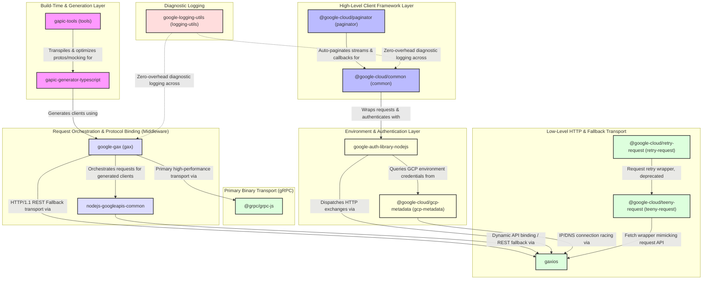
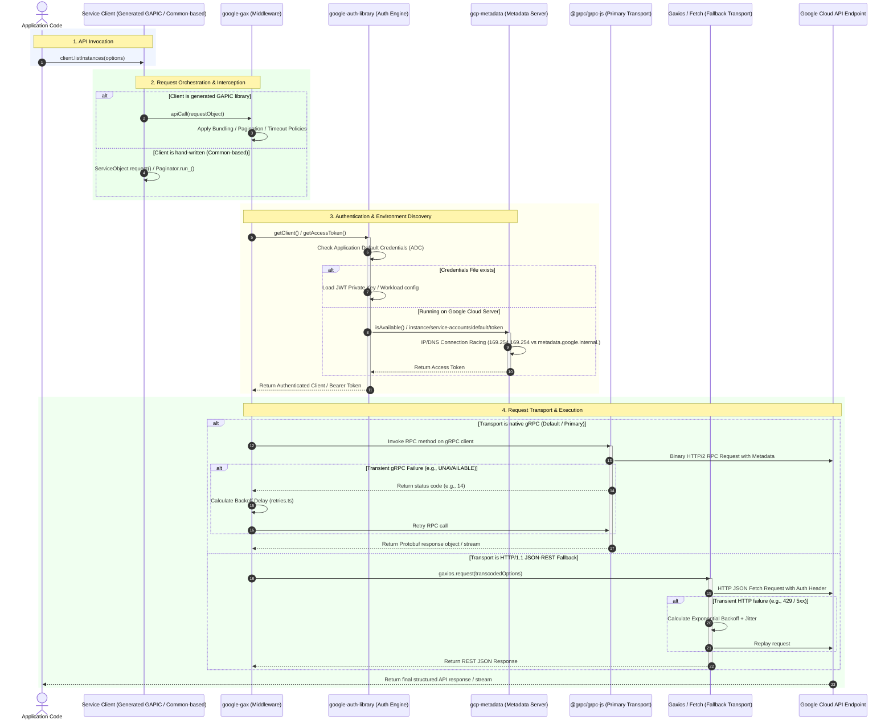

# Google Cloud Node.js Core Architectural Guide
# *WARNING*: This file is AI generated and may contain inaccuracies.

Welcome to the core architecture description for the `google-cloud-node` ecosystem. The packages under the `/core` directory form the complete shared base layer, build-time toolchain, request middleware, authentication flow, and network transport systems that power all downstream Google Cloud Platform client libraries (e.g., `@google-cloud/storage`, `@google-cloud/pubsub`, `@google-cloud/bigquery`, etc.).

---

## 🏗️ Core Layer Architecture

The diagram below shows the structural divisions and dependencies among the core packages. They span from build-time code generation to runtime request execution, protocol binding, authentication, and logging.

---

## 📂 Package Registry & Core Responsibilities

Below is a summary of each core package, explaining what it is, what it does, and how it fits as a building block in the ecosystem.

### 1. [google-gax](packages/gax/CODEMETA.md) (`google-gax`)
*   **Role**: Core Request Orchestration & Protocol Middleware.
*   **Purpose**: Bridges high-level generated client libraries (GAPIC) with low-level transport layers—primarily high-performance binary gRPC (`@grpc/grpc-js`) and HTTP/1.1 JSON-REST Fallback (`gaxios`). Since gRPC is the standard protocol for almost all high-throughput Google Cloud services (like Pub/Sub, Firestore, Bigtable, and Spanner), GAX acts as the primary wrapper around `@grpc/grpc-js` to orchestrate channel lifecycles and intercept RPC calls.
*   **Key Mechanisms**:
    *   **gRPC Channel & Client Lifecycle**: Loads static `.proto` files or JSON descriptors, manages channel connections, handles mutual TLS (mTLS) handshakes, and configures standard client settings.
    *   `createApiCall`: Central factory that intercepts gRPC call invocations to apply timeouts, deadline schedules, retry backoffs, and descriptor behaviors.
    *   **APICallers & Descriptors**: Wraps low-level `@grpc/grpc-js` calls into specialized executors: Unary (retries + backoff), Pagination (async-iterables/collection unrolling), Bundling (batching concurrent client requests to reduce network overhead), Streaming (wraps raw gRPC streams using `duplexify` for resilient duplex proxying and stream resumption), and Long-Running Operations (polling gRPC operation states).
    *   **REST Fallback & Transcoding**: Directs browser or HTTP fallback environments by converting Protobuf declarations into valid JSON REST payloads, matching URL routes, and chunking continuous streaming array streams.

### 2. [google-auth-library-nodejs](packages/google-auth-library-nodejs/CODEMETA.md) (`google-auth-library`)
*   **Role**: Shared Authentication & Credential Engine.
*   **Purpose**: Resolves credentials and manages OAuth 2.0 token loops, Service Accounts assertions, and federated identity tokens exchanges.
*   **Key Mechanisms**:
    *   **Application Default Credentials (ADC)**: Sequentially probes environments (`GOOGLE_APPLICATION_CREDENTIALS`), well-known local gcloud configuration paths, and local metadata servers to instantiate appropriate auth clients.
    *   **Credential Subclasses**: Implements specific behaviors for JSON Web Tokens (`JWT`), standard OAuth (`OAuth2Client`), Cloud Metadata Server (`Compute`), and Security Token Service (`stscredentials`).
    *   **Workload Identity Federation**: Manages token exchange (AWS, Azure, Kubernetes, or pluggable scripts) via RFC 8693 token endpoints, supporting downstream Service Account impersonation.
    *   **Dynamic Crypto Factory**: Bridges Node.js environment (using native C++ `crypto` bindings) with browser runtimes (using standard Web Crypto).

### 3. [gcp-metadata](packages/gcp-metadata/CODEMETA.md) (`gcp-metadata`)
*   **Role**: Environment Detection & Metadata Server Client.
*   **Purpose**: Queries the GCP Metadata Server (vital for serverless, Compute Engine, and GKE workloads) to fetch project IDs, regional zones, and service account OAuth tokens.
*   **Key Mechanisms**:
    *   **Residency Verification**: Probes Linux bios/DMI vendors (`/sys/class/dmi/id/bios_vendor`), network MAC addresses (checks matching `42:01` prefixes), and serverless environment variables to detect GCP hosting.
    *   **Connection Racing**: Speeds up checks by racing an IP-based query (`169.254.169.254`) against a DNS-based query (`metadata.google.internal.`) using `Promise.any` to avoid DNS resolution lags.
    *   **Safe Parsing**: Employs `json-bigint` to parse large server ID numbers without loss of precision.

### 4. [nodejs-googleapis-common](packages/nodejs-googleapis-common/CODEMETA.md) (`googleapis-common`)
*   **Role**: Dynamic Discovery & API Orchestrator (Internal Helper).
*   **Purpose**: Serves as the dynamic engine room for generated API clients by mapping Google Discovery Documents to executable JavaScript namespaces.
*   **Key Mechanisms**:
    *   `createAPIRequest`: The operational center that deep-merges options, maps aliased parameters, resolves path variables via URL template expansion, serializes arrays, and tracks multipart stream uploads.
    *   **Trusted Partner Cloud (TPC)**: Intercepts and routes target URLs to secure partner domains based on configurations, cross-validating credentials to prevent leakage.
    *   **HTTP/2 Session Pooling**: Pools multiplexed HTTP/2 sessions with proactive inactive session teardowns.

### 5. [gaxios](packages/gaxios/CODEMETA.md) (`gaxios`)
*   **Role**: Resilient HTTP/Fetch Client.
*   **Purpose**: Provides an `axios`-like interface built on top of native `fetch` (with a fallback to `node-fetch`), optimized for Google Cloud services.
*   **Key Mechanisms**:
    *   **Exponential Backoff Retries**: Configurable backoff multiplier and randomized jitter to reschedule requests during server failures.
    *   **Mutual TLS (mTLS)**: Resolves mTLS client certificates for secure HTTPS network channels.
    *   **Interceptors**: Supports asynchronous request and response pipelines.
    *   **Log Redaction**: Protects against credential leaks by automatically sanitizing authorization headers and URL search params from logs and errors.

### 6. [teeny-request](packages/teeny-request/CODEMETA.md) (`teeny-request`)
*   **Role**: Lightweight Fetch-based Request Wrapper.
*   **Purpose**: A minimal wrapper around `node-fetch` designed to replicate the legacy `request` API signature, minimizing bundle weight while ensuring compatibility.
*   **Key Mechanisms**:
    *   **Option Normalization**: Converts legacy options into standard `RequestInit` configurations.
    *   **Concurrency Management (`TeenyStatistics`)**: Tracks concurrent outbound requests. If counts cross warning thresholds (default: 5000), it logs warning notices once via `process.emitWarning` to prevent thread/socket exhaustion.
    *   **Proxy Filtering**: Handles `NO_PROXY` regular expressions and wildcard bypass mappings.

### 7. [common](common/CODEMETA.md) (`@google-cloud/common`)
*   **Role**: Base Inheritance & Resource Modeling Framework.
*   **Purpose**: Establishes the abstract class structures and request/retry pipelines for all hand-written Google Cloud client libraries.
*   **Key Mechanisms**:
    *   `Service`: Models a service endpoint (e.g., `storage.googleapis.com`). Coordinates authentication, intercepts requests, extracts active Project IDs, and injects user telemetry headers.
    *   `ServiceObject`: Models a specific cloud entity (like a Bucket, Dataset, or Pub/Sub Topic). Provides generic CRUD operations (`create`, `get`, `delete`, `setMetadata`) and forwards requests to the parent service, appending its own ID to paths.
    *   `Operation`: Extends `ServiceObject` to implement exponential polling loops for Long-Running Operations (LRO).

### 8. [paginator](paginator/CODEMETA.md) (`@google-cloud/paginator`)
*   **Role**: Callback, Promise, & Streaming Pagination Wrapper.
*   **Purpose**: Wraps paginated, cursor-based client methods to simplify result collection.
*   **Key Mechanisms**:
    *   `extend`: Monkey-patches class prototypes to wrap target methods.
    *   **Auto-Pagination**: Transparently fetches all pages of a resource and compiles results, returning them via a single Callback or resolved Promise.
    *   **Transform Stream (`ResourceStream`)**: Exposes an object-mode stream that fetches pages on-demand as downstream readers consume data, gracefully managing backpressure and API limits.

### 9. [logging-utils](packages/logging-utils/CODEMETA.md) (`google-logging-utils`)
*   **Role**: Zero-Overhead Diagnostic Logging Utility.
*   **Purpose**: Provides an optimized diagnostic logging layer that remains completely silent in production and is highly descriptive when enabled.
*   **Key Mechanisms**:
    *   **Zero-Overhead Fallback**: If logging is not enabled via `GOOGLE_SDK_NODE_LOGGING`, calls immediately return a static no-op placeholder function, avoiding allocations.
    *   **Pluggable Backends**: Swaps globally between colorized text console logging (`NodeBackend`), existing application logger hooks (`DebugBackend`), and GCP-compliant structured JSON logging (`StructuredBackend`).
    *   **Event Emitter Hooks**: Every namespaced logger acts as an `EventEmitter` emitting `'log'` packets, letting parent libraries tap into diagnostics.

### 10. [gapic-generator-typescript](generator/gapic-generator-typescript/CODEMETA.md)
*   **Role**: Client Libraries Compiler Pipeline.
*   **Purpose**: A `protoc` plugin and CLI compiler that parses Protocol Buffer (`.proto`) files into high-quality, production-ready TypeScript/JavaScript clients.
*   **Key Mechanisms**:
    *   **Metadata Augmentation**: Translates proto HTTP, pagination, retry, batching, and long-running operation annotations into structured configurations.
    *   **Nunjucks Template Engine**: Utilizes templates to render all output source code (clients, index files, documentation, configurations, and mocha/sinon test suites).
    *   **Verification Baselines**: Compares compiler outputs line-by-line against checked-in reference baselines (`baselines/` and `baselines-esm/`) to prevent regressions.

### 11. [tools](packages/tools/CODEMETA.md) (`gapic-tools`)
*   **Role**: Build-Time Proto Compilers & Babel Transformations.
*   **Purpose**: Provides the build scripting and Babel AST plugins needed to package, compile, and optimize client libraries for dual CJS/ESM distribution.
*   **Key Mechanisms**:
    *   `compileProtos`: Executes `pbjs`/`pbts` to generate JS/TS files, relaxing union types (Enums, Bytes, Longs) to provide developers with flexible API parameters.
    *   `prepublishProtos`: Gathers and copies Google's shared common proto files into local package folders so packages are self-contained before NPM publishing.
    *   **Babel AST Plugins**: Swaps ESM expressions (`import.meta.url`) for CJS equivalents (`__dirname`), toggles compilation flags, and rewrites test mocking imports (`esmock` ➔ `proxyquire`).

### 12. [retry-request](packages/retry-request/CODEMETA.md) (`@google-cloud/retry-request`)
*   **Role**: Request Retry Wrapper (*Deprecated*).
*   **Purpose**: A legacy HTTP request wrapper that automatically retried transient transport and HTTP errors using exponential backoff and jitter.
*   **Note**: Deprecated as of July 2024. Active HTTP retry and backoff capabilities have been consolidated directly inside the [gaxios](#5-gaxios-gaxios) client library.

---

## 🔄 Runtime Execution Lifecycle

The sequence diagram below illustrates how code execution flows through these building blocks. It tracks how a high-level application call propagates down through middleware, environment detection, authentication, and transport layers before returning a response.

