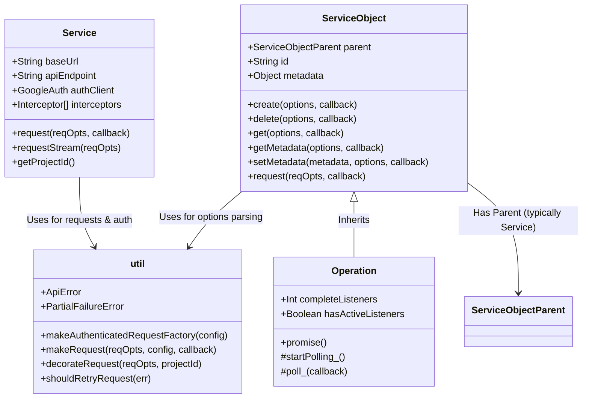

# `@google-cloud/common` Codebase Metadata
# *WARNING*: This file is AI generated and may contain inaccuracies.

This document provides an architectural overview, file map, and development reference for the `@google-cloud/common` package located in the `core/common` directory.

---

## 📖 Overview

`@google-cloud/common` is the core foundational layer for Google Cloud Platform (GCP) Node.js client libraries. It standardizes HTTP request construction, authentication, retries, stream wrapping, and resource model representations. Rather than having every service library (e.g., `@google-cloud/storage`, `@google-cloud/bigquery`, or `@google-cloud/pubsub`) implement its own authentication, request building, and error handling, they inherit from or compose the classes and utilities provided by this package.

### Core Design Philosophy
1. **Inheritance-based Architecture**: High-level services and resources inherit from abstract base classes (`Service` and `ServiceObject`) to share behavior like authentication and generic CRUD methods.
2. **Unified Request Lifecycle**: All REST API requests run through a single pipeline that automatically handles token updates, endpoint overrides, request interception, custom user-agents, and retry policies.
3. **Callback-to-Promise Promisification**: Standard methods are defined as callback-based internally, and automatically wrapped with `@google-cloud/promisify` to expose an elegant Promise/async-await API to end-users.

---

## 📐 Core Architecture & Hierarchy

The interaction between the primary classes and utilities can be visualized as follows:

---

## 🗂️ Source Code File Map (`src/`)

The primary logic of the package is isolated in the `src/` directory:

| File Name | Primary Exports | Detailed Responsibility |
| :--- | :--- | :--- |
| **[`index.ts`](src/index.ts)** | `Service`, `ServiceObject`, `Operation`, `util`, `ApiError`, `AbortableDuplex` | The main entry point of the package. It acts as a barrel export, aggregating and re-exporting all public classes, types, and utility collections for downstream client libraries to consume. |
| **[`service.ts`](src/service.ts)** | `Service`, `ServiceConfig`, `ServiceOptions`, `StreamRequestOptions` | Defines the **`Service`** base class. Represents a cloud service endpoint (e.g. `storage.googleapis.com`). It initializes the authentication client (`GoogleAuth`), configures request interceptors, dynamically fetches/updates the GCP Project ID, appends correct telemetry headers (`User-Agent` & `x-goog-api-client`), and wraps requests through `util.makeAuthenticatedRequestFactory`. |
| **[`service-object.ts`](src/service-object.ts)** | `ServiceObject`, `ServiceObjectConfig`, `Interceptor`, `MetadataCallback` | Defines the **`ServiceObject`** class. Represents a single resource or entity under a service (like a Bucket, a BigQuery Dataset, or a Pub/Sub Topic). Extends `EventEmitter`. Provides generic CRUD method definitions (`create`, `get`, `exists`, `delete`, `getMetadata`, `setMetadata`). Delegates all HTTP/stream requests back to its parent `Service` or `ServiceObject` instance while prefixing URI paths with its own resource ID. Automatically promisified via `@google-cloud/promisify`. |
| **[`operation.ts`](src/operation.ts)** | `Operation` | Extends `ServiceObject` to handle **Long-Running Operations (LROs)**. Downstream cloud operations that are completed asynchronously by GCP servers (e.g., bulk imports, schema updates) inherit from this class. It listens for standard `complete` event handlers to automatically trigger an exponential background polling loop that fetches updated metadata until the operation's status is marked `done: true`. |
| **[`util.ts`](src/util.ts)** | `util`, `ApiError`, `PartialFailureError`, `ProgressStream`, `Abortable` | A rich collection of helper functions and custom error classes. Implements request authorization hooks, request decoration (which safely replaces raw `{{projectId}}` tokens with the active project ID across URIs, headers, and JSON payloads), response parsing, HTTP retry verification, Duplex stream piping, and User-Agent formatting. |

---

## 🧪 Unit Test Suite File Map (`test/`)

Unit tests are stored under `test/` and follow the exact name structure of the files under `src/`. They validate isolated library components offline using `Mocha` as the test runner, `Sinon` for method stubbing/sandboxing, and `proxyquire` for dependency injection overriding.

| Test File | Target File | Detailed Test Scopes |
| :--- | :--- | :--- |
| **[`index.ts`](test/index.ts)** | `src/index.ts` | Verifies public export matching and type/class mappings. Ensures downstream clients have seamless access to the full core interface. |
| **[`service.ts`](test/service.ts)** | `src/service.ts` | Tests `Service` class instantiation, base configurations (`baseUrl`, `apiEndpoint`), specific Cloud Functions environment triggers (forces `forever: false`), telemetry header injection (`x-goog-api-client`), Request Interceptor ordering, dynamic project ID extraction/caching from the auth client, and correct path resolution in standard `request_` and `requestStream` handlers. |
| **[`service-object.ts`](test/service-object.ts)** | `src/service-object.ts` | Focuses on whitelisting of API methods on instantiation, full validation of `create`, `delete`, `exists`, `get`, `getMetadata`, and `setMetadata` lifecycles. Validates the `autoCreate` flow (which dynamically retries on Conflict `409` or retrieves on Missing `404` errors). Evaluates path formatting (stripping empty components, slash-trimming, supporting absolute URLs) and multi-layered interceptor chaining across parent-child class structures. |
| **[`operation.ts`](test/operation.ts)** | `src/operation.ts` | Assesses the polling loop for Long-Running Operations. Mocks internal operational check-points (`startPolling_`, `poll_`) using Sinon sandboxes. Verifies proper registration of the `complete` event listener, exponential polling timing, retry triggers, progress error propagation, and standard callback/promise returns. |
| **[`util.ts`](test/util.ts)** | `src/util.ts` | The largest and most comprehensive unit test file in the package. Validates utility routines: • **`ApiError` & `PartialFailureError`**: Error formatting, duplicate message filtering, multi-error array mapping, and parsing response JSON bodies. • **`handleResp`**: Structured error identification and extraction of status codes from HTTP response packets. • **`makeWritableStream`**: Multi-part form uploads, custom type boundary wrapping, progress notifications, and stream completion events. • **`makeAuthenticatedRequestFactory`**: Authentication client setups, active header mappings, query replacements, abort forwarding, and fallback projectId hooks. • **`shouldRetryRequest`**: Identification of retryable HTTP errors (408, 429, 500, 502, 503, 504) and DNS query address errors (`EAI_AGAIN`). • **`makeRequest`**: Custom retry algorithms, deprecated argument handling, readable/writable stream pipeline construction (GET vs POST request handling), and stream/request abort mechanics. • **`decorateRequest`**: Cleaning of utility pagination properties (`autoPaginate`, `objectMode`) and token substitution (`{{projectId}}`) inside JSON structures, arrays, queries, and URIs. |

---

## 🧪 System & Integration Test Suite File Map (`system-test/`)

System tests verify the functionality of the `@google-cloud/common` library using live Node.js web environments and compiler testing.

| Integration File | Purpose & Test Scopes |
| :--- | :--- |
| **[`common.ts`](system-test/common.ts)** | Launches a local live Node.js HTTP mock server on `localhost:8118` to perform real-world integration checks: • **Request Pipeline**: Validates successful HTTP requests and response payloads handled by `Service.request`. • **Retry Mechanics**: Simulates server failures using code `408` and asserts that the service attempts requests exactly 4 times (1 initial + 3 retries) before returning the error. • **Timeout Backoffs**: Queries unresponsive mock endpoints and verifies that connection failure errors (like `ECONNREFUSED`) correctly respect exponential time backoff rules. |
| **[`install.ts`](system-test/install.ts)** | Validates package installation and TypeScript declaration compilation correctness: • Generates a release package tarball (`.tgz`) using `npm pack`. • Copies a dummy client fixture project (`system-test/fixtures/kitchen`). • Executes `npm install` within the fixture project using the local package tarball, validating that compile-time definitions (`.d.ts`) compile cleanly and are fully importable by client systems. |
| **[`fixtures/kitchen/`](system-test/fixtures/kitchen)** | A minimal testing project that acts as a consumer application. Contains `package.json`, `tsconfig.json`, and a `src/index.ts` importing public classes, methods, and types from `@google-cloud/common` to verify interface compilation validity. |

---

## 🔧 Tooling & Configuration Files

The root directory contains several configuration files that define the CI/CD pipelines, testing setup, and formatting guidelines for the repository:

* **`.OwlBot.yaml` & `owlbot.py`**: Used by OwlBot (Google's automated template synthesis tool) to copy, post-process, and keep repository structure, dependencies, and config templates in sync with Google's central templates.
* **`.trampolinerc`**: Configures GCB (Google Cloud Build) Trampoline, which is used to orchestrate containerized CI builds, testing tasks, and release steps.
* **`.mocharc.js`**: Defines standard Mocha test runner options, including timeout values, file extensions, and reporters used during test execution.
* **`.nycrc`**: Configuration for `c8` test coverage metrics. Establishes thresholds and reporter formats for code execution analysis.
* **`.jsdoc.js` & `.compodocrc`**: Setup options for generation of developer-facing JSDoc HTML API reference documentation.
* **`tsconfig.json`**: Controls TypeScript compiler rules and output build directories (`build/src` and `build/test`).
* **`package.json`**: Specifies metadata, runtime engine criteria (e.g. `node >= 18`), NPM scripts (e.g. `compile`, `test`, `lint`, `system-test`), and external runtime dependencies (e.g. `google-auth-library`, `teeny-request`, `retry-request`).
