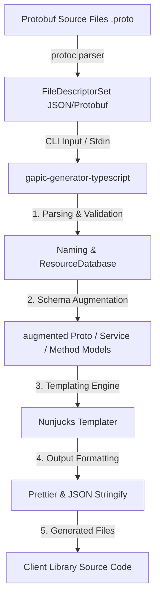
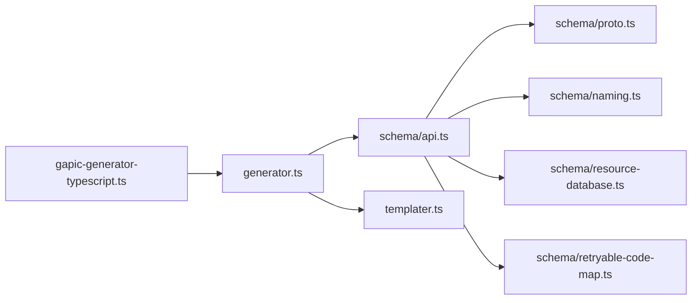
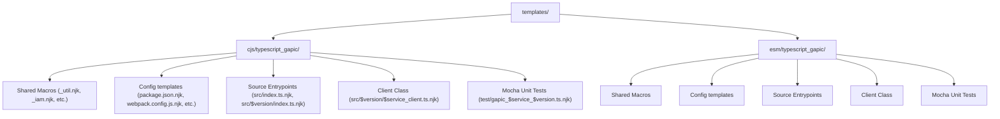

# `@google-cloud/gapic-generator-typescript` — Codebase Metadata & Developer Guide
# *WARNING*: This file is AI generated and may contain inaccuracies.

This document provides a comprehensive, developer-oriented overview of the `@google-cloud/gapic-generator-typescript` repository. It outlines the codebase's architectural goals, lists and describes its core components, maps out its directory structure, and explains the complete testing and baseline verification suite in detail.

---

## 1. Architectural & Functional Overview

The `@google-cloud/gapic-generator-typescript` package is a code generator used to compile **Protocol Buffer (`.proto`)** definitions into robust, production-ready **Google Cloud client libraries** for Node.js and modern JavaScript environments. 

It operates as a plugin for the standard protobuf compiler (`protoc`) or is run directly as a CLI tool using compiled protobuf file descriptors. The generated clients conform to the **Google API Improvement Proposals (AIPs)** and support multiple transport layers, including **gRPC**, **gRPC-Fallback (HTTP/1.1 JSON)**, and native **REST (Discovery-based)** interfaces.

### Key Design Patterns
- **Metadata-Driven Code Generation**: The generator augments raw protobuf descriptors (`FileDescriptorProto`, `ServiceDescriptorProto`, `MethodDescriptorProto`) with custom Google APIs configurations (such as `google.api.http` annotations, long-running operations parameters, retry settings, client-side batching, and resource patterns) before passing them to a templates layer.
- **Nunjucks Template Orchestration**: Standard template engines (`Nunjucks`) define the layouts and source text for generated files (`src/v1/some_client.ts`, `package.json`, `tsconfig.json`, system-tests, READMEs). This ensures separation of generator parsing rules from the code design of the generated client.
- **Baseline-Based Verification**: Because client code must remain syntactically perfect and exactly match GCP guidelines, the generator is verified using **baselines**. The output of compiling test protobuf definitions is compared line-by-line against reference directories checked into the repository.

### Code Generation Pipeline



---

## 2. Directory Map & Core Folders

The repository is structured as follows:

| Directory / Path | Purpose & Contents |
| :--- | :--- |
| [`baselines/`](baselines) | Checked-in reference output folders representing correct CommonJS client generations for showcase and official GCP APIs. |
| [`baselines-esm/`](baselines-esm) | Reference output folders representing correct modern ECMAScript Module (ESM) client generations. |
| [`protos/`](protos) | Contains static TypeScript type descriptors (`index.d.ts`, `protos.json`) generated from Google API definitions used at runtime. |
| [`rules_typescript_gapic/`](rules_typescript_gapic) | Custom Bazel build rules and macro files (`typescript_gapic.bzl`) integrating the generator with Bazel compilation targets. |
| [`templates/`](templates) | Nunjucks (`.njk`) templates defining source file layouts (TypeScript classes, package/linter configs, testing harnesses). |
| [`test-fixtures/`](test-fixtures) | Sample proto files, service configs, and JSON options representing edge cases and showcase API definitions. |
| [`typescript/src/`](typescript/src) | Core TypeScript implementation files for schema parsing, mapping, CLI input, and templates compilation. |
| [`typescript/test/`](typescript/test) | Unit tests, baseline verification drivers, and custom test runner utilities. |
| [`typescript/tools/`](typescript/tools) | Standalone utility scripts (e.g., `update-baselines.ts`) supporting the development workflow. |

> [!NOTE]
> Directories prefixed with `.test-out-` (such as `.test-out-dlp/` or `.test-out-asset/`) are temporary directories generated dynamically during baseline verification and are excluded from version control.

---

## 3. Core Configuration Files

- **[`package.json`](package.json)**: Defines package properties, dependencies (e.g., `nunjucks`, `protobufjs`, `yargs`, `prettier`), and scripts:
  - `compile`: Compiles TypeScript source in `typescript/` into runnable JavaScript inside the `build/` folder.
  - `test`: Executes both the unit test suites and baseline integration tests.
  - `baseline`: Runs baseline updates when template changes are verified.
- **[`tsconfig.json`](tsconfig.json)**: TypeScript compiler options directing the transpiler to output ECMAScript compatibility targets, resolve modern modules, and preserve typings.
- **[`BUILD.bazel`](BUILD.bazel) / [`WORKSPACE`](WORKSPACE) / [`MODULE.bazel`](MODULE.bazel)**: Configuration for the Bazel build pipeline, managing external workspace dependencies and compilation targets sandbox-style.

---

## 4. Deep Dive: Source Code Components (`typescript/src/`)

Core execution logic is located in [`typescript/src/`](typescript/src):



### `gapic-generator-typescript.ts`
The **main command-line entry point**. It handles arguments parsing (e.g., output directory, templates config, package name, transport type, gRPC service config) using `yargs`. It loads compiled protobuf file descriptor paths and passes parsed options down to the code generator orchestrator.

### `generator.ts`
The **core orchestration engine**. It coordinates:
1. Reading protobuf file descriptors from stdin or input arguments.
2. Instantiating the `API` parsing object to build a comprehensive schema graph.
3. Triggering the templating pipeline through the `Templater` class.
4. Formatting and post-processing all generated output files with `Prettier` and JSON serializers.

### `templater.ts`
Manages **Nunjucks rendering**. It compiles template templates (configured in [`templates/`](templates)) using the augmented API metadata, translating them into actual client classes, helper files, configuration maps, and documentation.

---

### The Schema Representation Layer

To support templates, raw Protobuf schemas must be augmented with advanced structural details. This logic is organized inside `typescript/src/schema/`:

#### [`schema/api.ts`](typescript/src/schema/api.ts)
Aggregates parsed resources and packages into a single representation of the API client. It initializes naming conventions, tracks and resolves resource maps, filters out common system helper packages, and tracks available API versions.

#### [`schema/proto.ts`](typescript/src/schema/proto.ts)
The largest and most complex class. It maps gRPC structures into client features:
- **LRO (Long-Running Operations)**: Parses `google.longrunning.operationInfo` annotations to identify returned response and metadata types.
- **Pagination**: Implements Google AIP-158 pagination rules. Validates request and response fields (`page_token`, `page_size`, `next_page_token`, and repeated collection resources) to automatically decorate methods with paging wrappers.
- **Routing Parameters & HTTP Headers**: Maps standard parameters in `google.api.http` rules to default headers, and processes advanced `google.api.routing` annotations using matching regex to generate client-side routing keys.
- **Retry Configurations**: Maps status codes and timeouts into structured settings compatible with the `google-gax` library.
- **Service Mixins**: Processes options to auto-inject helpers like IAM Policy, Cloud Locations, and Long-Running Operations unless the client overrides them.

#### [`schema/naming.ts`](typescript/src/schema/naming.ts)
Parses package and namespace hierarchy configurations (e.g., `google.cloud.speech.v1`) to extract valid JavaScript identifiers, client library class names, product versions, and publishing parameters.

#### [`schema/resource-database.ts`](typescript/src/schema/resource-database.ts)
Indexes all resource patterns (`google.api.resource` and `google.api.resource_definition`). It:
- Maps resource types to specific path patterns.
- Handles complex multi-pattern entities by calculating unique disambiguated naming segments.
- Walks up resource segments to resolve hierarchical parent-child relationships.

#### [`schema/retryable-code-map.ts`](typescript/src/schema/retryable-code-map.ts)
Manages mappings between gRPC status codes and snake_case parameter aliases (e.g., `idempotent` vs `non_idempotent`), compiling correct JSON retry blocks for client configurations.

#### [`schema/comments.ts`](typescript/src/schema/comments.ts)
Extracts code-level documentation comments from protobuf elements, compiling cleanly formatted jsdoc summaries for generated methods.

---

## 5. The Testing & Baseline Verification Suite

The codebase features a two-tier testing structure: **Granular Unit Tests** (focusing on logical algorithms and configuration parsing) and **Baseline Integration Tests** (focusing on full-scale code generation).

```
typescript/test/
├── unit/                               # Granular unit test suites
│   ├── api.ts
│   ├── naming.ts
│   ├── proto.ts
│   ├── resource-database.ts
│   ├── retryable-code-map.ts
│   └── util.ts
├── baselines.ts                        # CommonJS baseline integration runner
├── baselines-esm.ts                    # ESM baseline integration runner
├── unit-test-runner.ts                 # Custom Mocha test orchestrator
└── util.ts                             # Baseline execution and diff utility
```

### 1. Unit Testing Infrastructure

- **[`unit-test-runner.ts`](typescript/test/unit-test-runner.ts)**: Programmatically initializes a Mocha runner instance, scans the compiled `build/typescript/test/unit/` directory, dynamically loads the tests, and handles process codes.
- **[`unit/util.ts`](typescript/test/unit/util.ts)**: Validates global text transformations and duration calculations (`commonPrefix`, `seconds`, `milliseconds`, `capitalize`, `words`, casing maps, and URL path-template parsing regex).
- **[`unit/naming.ts`](typescript/test/unit/naming.ts)**: Verifies namespace parsing conventions. Asserts that the generator identifies versions, namespace groupings, and handles errors (such as package mismatch or invalid structure).
- **[`unit/resource-database.ts`](typescript/test/unit/resource-database.ts)**: Asserts correct indexing of resource descriptors. Tests multi-pattern registrations, pluralizations, custom slash delimiters (e.g. `taskId-taskName`), and parent-child tree generation.
- **[`unit/retryable-code-map.ts`](typescript/test/unit/retryable-code-map.ts)**: Verifies status codes mapping configurations. Tests hash caching for retry configurations and validates that custom retry definitions resolve to expected JSON layouts.
- **[`unit/api.ts`](typescript/test/unit/api.ts)**: Verifies the high-level API class initialization logic. Asserts proper behavior for standalone package generations (like IAM or Location services) and checks that missing required host options throw clear errors.
- **[`unit/proto.ts`](typescript/test/unit/proto.ts)**: Assertions for the complex parsing behavior inside `schema/proto.ts`. Verifies parameter extraction, regex generation from routing templates, pagination detection, LRO validations, and auto-populated request ID fields.

---

### 2. Baseline Integration Testing

Because code compilation is a deterministic process, integration testing relies on **baseline snapshots**.

#### Integration Drivers
- **[`baselines.ts`](typescript/test/unit/baselines.ts)**: Driver defining baseline tests for all supported Google Cloud APIs using the standard CommonJS format.
- **[`baselines-esm.ts`](typescript/test/unit/baselines-esm.ts)**: Driver verifying that compiling libraries using the ECMAScript Modules (`format: 'esm'`) option results in ESM-compliant outputs.

The baseline suite executes runs across representative GCP and Showcase APIs, verifying features including:
- **`bigquery-v2`**: Advanced queries and massive schemas.
- **`logging`**: High-throughput log delivery utilizing batching/bundling configurations.
- **`showcase`**: A testbed API verifying REST transport features, numeric enums, mixins control, and legacy proto loading.
- **`compute`**: Testing GCE REST-only discovery API interfaces (`diregapic: true`).
- **`deprecatedtest`**: Validates that APIs correctly mark methods and classes as `@deprecated`.
- **`routingtest`**: Verifies that complex, multi-parameter dynamic routing rule templates map to matching regex rules.

#### Baseline Execution Engine: [`test/util.ts`](typescript/test/util.ts)
`test/util.ts` extends Mocha with a custom snapshot validator:
1. Receives a `BaselineOptions` block configuring compilation variables.
2. Wipes any previously generated output directory (under `.test-out-*`).
3. Formulates and spawns a child process to execute the compiler (`gapic-generator-typescript.js`) with target configurations.
4. Walks the newly generated directory recursively and compares each generated file line-by-line against the reference baseline inside `baselines/` (or `baselines-esm/`).
5. Highlights exact file paths and mismatched line coordinates on error, failing the suite if any discrepancy is found.

---

## 6. Development Workflow & Utility Tools

When modifying the templates in `templates/` or the parsing engine in `src/`, generated outputs will inevitably diverge from reference baseline expectations, causing `npm test` to fail.

To propagate changes across all reference baseline directories, developers use the custom baseline updater tool via `npm run baseline`:

### [`typescript/tools/update-baselines.ts`](typescript/tools/update-baselines.ts)

This script programmatically automates baseline synchronization:
1. Scans the root directory and removes all obsolete trial outputs (`.test-out-*`).
2. Attempts to run `npm test`. If all baseline comparisons succeed, it exits early.
3. If comparisons fail, it identifies all generated trial folders, extracts the matching library name, and deletes the matching baseline reference folders under `baselines/` or `baselines-esm/`.
4. Copies the generated code to the baseline folder, adding `.baseline` suffixes to the files.
5. For `package.json` files, it copies them cleanly and sets up a relative symlink to `package.json.baseline`, ensuring compatibility with standard package managers and automated upgrade bots (like Renovate).

**Command usage:**
```bash
# Build the generator and run baseline sync
npm run compile
npm run baseline
```

---

## 7. Nunjucks Templates Inventory (`templates/`)

The generator relies entirely on **Nunjucks (`.njk`)** templates to separate compilation schemas from the visual design of the generated codebase. These templates define the structure, naming conventions, classes, configurators, and test harnesses for the compiled libraries.

### Template Target Structures

The `templates/` folder is organized into two parallel targets to support target compatibility targets:
1. **CommonJS (CJS) (`templates/cjs/`)**: Generates standard Node.js client modules using `require()` statements, CJS testing setups, and classic target builds.
2. **ECMAScript Modules (ESM) (`templates/esm/`)**: Generates modern ESM modules utilizing `import`/`export` syntax, transpiled bundle configurations, and ESM compilation pipelines.



---

### Shared Macro Utilities & Mixins

The following Nunjucks files define reusable utility macros loaded by main source templates to keep code generation modular:

| File Path | Purpose & Description | Key Macros / Operations Defined |
| :--- | :--- | :--- |
| **`_license.njk`** | Injects consistent, standard Apache-2.0 copyright headers dynamically stamped with the copyright year into every source, config, and test file. | `license(copyrightYear)` |
| **`_namer.njk`** | Encapsulates naming helpers for variables, services, and package modules, initializing class descriptors cleanly. | `initialize(id, service)` |
| **`_util.njk`** | The central template library. Resolves protobuf schema models into type-safe TypeScript parameters, compiles routing configs, and generates docstring blocks. *(See mini-roadmap below)* | `printComments`, `buildHeaderRequestParam`, `initRequestWithHeaderParam`, `toInterface`, `typescriptType` |
| **`_iam.njk`** | Handles the standard IAM Policy API Mixin. Auto-generates JSDoc and client wrappers for checking and mutating service access policies. | `iamServiceMethods(service)` (`getIamPolicy`, `setIamPolicy`, `testIamPermissions`) |
| **`_locations.njk`** | Handles the Cloud Locations API Mixin. Auto-generates helper wrappers for querying service regions and data residency regions. | `locationServiceMethods(service)` (`getLocation`, `listLocations`) |
| **`_operations.njk`** | Handles the standard Long-Running Operations (LRO) Mixin. Generates stubs for managing operations execution lifecycles. | `operationsServiceMethods(service)` (`getOperation`, `cancelOperation`, `deleteOperation`) |

---

### Configuration & Project Harness Templates

These templates output the scaffolding needed to build, lint, test, and publish the target NPM package:

- **`package.json.njk`**: Maps generator metadata into a fully structured `package.json` file containing all required production runtime libraries (e.g., `google-gax`, `protobufjs`), build utilities (`typescript`, `gts`, `mocha`), and lifecycle commands.
- **`tsconfig.json.njk` / `tsconfig.esm.json.njk`**: Emits project configuration targets for TypeScript, configuring standard path parameters, strict type checks, and module target compilations.
- **`webpack.config.js.njk` / `webpack.config.cjs.njk`**: Generates a ready-to-use Webpack bundle configuration enabling the client library to seamlessly execute in frontend browser environments utilizing gRPC fallback channels.
- **`README.md.njk`**: Auto-generates standard, copy-paste friendly Markdown documentation including:
  - Quickstart guides detailing install commands.
  - Clean authentication patterns (ADC setups).
  - Quick reference tables detailing all service clients and methods.
- **`.jsdoc.js.njk` / `.jsdoc.cjs.njk`**: Emits configuration details pointing JSDoc pipelines to correctly compile code documentation pages.
- **`.mocharc.js.njk` / `.nycrc.njk`**: Bundles testing orchestrations directing Mocha and NYC code-coverage utilities to execute generated unit tests.

---

### Module Entrypoints & Index Templates

These templates establish clear module exports for modular imports:

- **`src/index.ts.njk`**: The main entrypoint for the output library. Exports the full module, exposing all available API versions, namespace clients, and auxiliary proto models.
- **`src/$version/index.ts.njk`**: Aggregates and exports individual client classes and proto definitions specific to a single API release version (e.g. `v1` or `v2`).

---

### Detailed Mini-Roadmap: `src/$version/$service_client.ts.njk` (1,181 lines)

This is the primary code template responsible for emitting the **main TypeScript service client class**. It manages stub construction, channel orchestration, transports, fallback mechanisms, and client-side features like pagination and LRO handlers.

#### Key Sections & Points of Interest

```carousel
```typescript
// Phase 1: Imports & Setup (Lines 1 - 74)
// - Imports standard Node.js Stream helpers, path patterns, and google-gax modules.
// - Resolves proto loading formats (compiled static protos vs dynamic JSON descriptors).
// - Configures fallback HTTP/1.1 connections when native gRPC is unavailable.
```
<!-- slide -->
```typescript
// Phase 2: Class Definition & Properties (Lines 75 - 108)
// - Extends class properties representing client options.
// - Declares stub instances, routing parameter paths, and mixin operations clients.
```
<!-- slide -->
```typescript
// Phase 3: Constructor & Options Loader (Lines 110 - 408)
// - Formulates default endpoints and user-agent header metrics.
// - Instantiates custom gRPC and gRPC-Fallback channel structures.
// - Maps long-running operations (LRO), paging, and streaming descriptors.
```
<!-- slide -->
```typescript
// Phase 4: initialize() & Stub Connection (Lines 410 - 507)
// - Orchestrates asynchronous server handshakes.
// - Decorates low-level gRPC stubs with client decorators (retries, timeouts, headers).
```
<!-- slide -->
```typescript
// Phase 5: Unary Method Stubs (Lines 600 - 733)
// - Emits standard asynchronous functions matching protobuf RPC methods.
// - Automatically constructs header routing parameters and auto-injects UUID fields.
```
<!-- slide -->
```typescript
// Phase 6: Streaming & LRO Implementations (Lines 734 - 933)
// - Emits duplex and simplex connection channels returning CancellableStream wrappers.
// - Generates LRO wrapper operations alongside GetOperation getters (checkProgress methods).
```
<!-- slide -->
```typescript
// Phase 7: Auto-Pagination (Lines 934 - 1104)
// - Injects auto-pagination decorators for AIP-158 compliant list methods.
// - Exposes both stream channels (Stream) and standard async-iterators (Async).
```
<!-- slide -->
```typescript
// Phase 8: Path Renderers & Channel Cleanup (Lines 1115 - 1181)
// - Emits regex matcher and renderer blocks parsing protobuf path segments.
// - Declares close() termination routines tearing down active connection channels.
```
```

---

### Detailed Mini-Roadmap: `test/gapic_$service_$version.ts.njk` (1,613 lines)

This template outputs the **comprehensive unit testing suite** verified under Mocha and Sinon. It creates stubs for every transport method, asserts routing parameters, verifies exception propagation, and exercises mixins without requiring actual network connections.

#### Key Sections & Points of Interest

```carousel
```typescript
// Phase 1: Setup, Imports & Proto Parsing (Lines 1 - 83)
// - Imports Sinon, assert, mocha, and the generated client module.
// - Resolves default field value lookup methods (getTypeDefaultValue) using the JSON proto definitions.
```
<!-- slide -->
```typescript
// Phase 2: Sinon Stub Factories (Lines 84 - 201)
// - Defines generic mocks to inject into the testing stubs.
// - Exposes stub builders customized for each RPC flavor:
//   - stubSimpleCall, stubServerStreamingCall, stubBidiStreamingCall,
//   - stubClientStreamingCall, stubLongRunningCall, stubPageStreamingCall.
```
<!-- slide -->
```typescript
// Phase 3: Client Core Feature Verification (Lines 203 - 365)
// - Asserts configuration parsing and default variable lookups.
// - Tests universeDomain ("googleapis.com") parsing overrides and endpoint builders.
// - Verifies basic initialize() and close() execution cycles.
```
<!-- slide -->
```carousel
// Phase 4: Unary & Streaming Assertions (Lines 366 - 839)
// - Exercises unary method stubs, verifying that responses deep-equal stub results.
// - Tests error forwarding, request argument verification, and UUID auto-population.
// - Asserts Node Stream stream lifecycle methods on data/error events.
```
<!-- slide -->
```typescript
// Phase 5: Pagination & Async Iterator Checks (Lines 840 - 1088)
// - Validates standard pagination call arguments.
// - Tests that stream wrappers receive correct configurations and route results cleanly.
// - Asserts that Async iterables return expected chunks iteratively under for-await loops.
```
<!-- slide -->
```typescript
// Phase 6: GCP Mixin Mocking (Lines 1089 - 1567)
// - Stub-verifies mixin method integrations (IAMPolicy, Cloud Locations, and LROs).
// - Confirms that the mixin clients correctly forward payload requests and headers.
```
<!-- slide -->
```typescript
// Phase 7: Path Template Rendering (Lines 1568 - 1612)
// - Generates assertions for path builder renderers (e.g. client.somePath()).
// - Exercises path segment regex parsing methods, ensuring parsed parameters match input segments.
```
```

---

### Detailed Mini-Roadmap: `_util.njk` (502 lines)

The primary shared utility macro suite. It drives JSDoc annotation compilation, request/response mock generation for unit tests, and routing parameter parsing.

#### Key Sections & Points of Interest

- **JSDoc Generation (Lines 21 - 261)**:
  - `printComments`: High-level orchestrator for a method's JSDoc, printing descriptions, parameters, options, and type definitions.
  - `printReturn`: Dynamically generates customized JSDoc `@returns` descriptions based on whether a method is paging, server-streaming, client-streaming, LRO, or standard unary.
- **Header Parameter Generation (Lines 262 - 298)**:
  - `buildHeaderRequestParam`: Generates the code that builds the `x-goog-request-params` header dynamically. It handles both standard implicit routing parameters and advanced `google.api.routing` dynamic regex rules.
- **Unit Test Initializers (Lines 300 - 418)**:
  - `initRequestWithHeaderParam`: Creates mock request messages for test suites, dynamically looking up default values to ensure exact regex matching inside routing tests.
  - `initResponse` & `initPagingResponse`: Generates realistic stub payloads to feed Sinon stubs in unit tests.
- **Type Translators (Lines 419 - 502)**:
  - `typescriptType` & `toInterface`: Translates raw protobuf descriptor types into their corresponding TypeScript equivalents (e.g. `TYPE_BYTES` -> `Buffer`, custom types -> `protos.some.Interface`).

