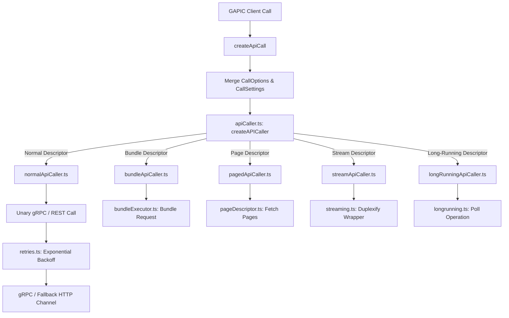

# Google API Extensions (google-gax) Architecture Reference
# *WARNING*: This file is AI generated and may contain inaccuracies.

`google-gax` (Google API Extensions) is the core middleware transport and orchestration layer for Google Cloud Client Libraries in Node.js. Its primary purpose is to bridge high-level, automatically generated GAPIC (Google API Programming Interface Client) libraries with low-level network protocols like **gRPC** (`@grpc/grpc-js`) and **HTTP/1.1 JSON-REST Fallback** (`gaxios`).

By providing a common set of behaviors—including exponential retries, request bundling (batching), automatic pagination unrolling, streaming duplex proxying, and long-running operation polling, `google-gax` ensures that Google Cloud clients behave consistently, efficiently, and resiliently under all network conditions.

---

## 1. High-Level Request Lifecycle

The core pattern in GAX is a **Descriptor-Driven Call Orchestration**. Client libraries do not make raw gRPC calls; instead, they invoke wrapped functions generated by `createApiCall`. Based on settings and custom descriptors supplied at call-creation time, `google-gax` dynamically intercepts and augments the request.

---

## 2. Core Module Map

The library's core codebase resides within the `src/` directory. Below is an itemized map of each module's role and design pattern.

| Module / Directory | File | Primary Responsibility | Key Design Patterns & Dependencies |
| :--- | :--- | :--- | :--- |
| **Call Orchestration** | [createApiCall.ts](src/createApiCall.ts) | Central factory that wraps low-level RPCs with timeout, retry, and descriptor-driven behaviors. | Factory Pattern, Decorator Pattern |
| | [apiCaller.ts](src/apiCaller.ts) | Defines the `APICaller` interface and dispatches calls to specialized callers based on the descriptor type. | Factory Method Pattern |
| | [descriptor.ts](src/descriptor.ts) | Base interface for `Descriptor` and implementations for specialized call markers. | Strategy Pattern |
| | [call.ts](src/call.ts) | Manages asynchronous call state, response/error propagation, and explicit request cancellation. | Promise Wrap, Observer Pattern |
| **Unary Calls** | [normalCalls/normalApiCaller.ts](src/normalCalls/normalApiCaller.ts) | Handles default single-request single-response (unary) calls. | Direct Execution Wrapper |
| | [normalCalls/retries.ts](src/normalCalls/retries.ts) | Implements exponential backoff retry loops using canonical error codes. | Retry Loop, Backoff Strategy |
| | [normalCalls/timeout.ts](src/normalCalls/timeout.ts) | Computes and attaches hard deadlines to outgoing RPC metadata. | Deadline Scheduling |
| **Request Bundling** | [bundlingCalls/bundleDescriptor.ts](src/bundlingCalls/bundleDescriptor.ts) | Extracts request elements and packs them using discriminator fields. | Strategy Pattern |
| | [bundlingCalls/bundleApiCaller.ts](src/bundlingCalls/bundleApiCaller.ts) | Delegates execution of single requests to the shared batch executor. | Client-Facing Proxy |
| | [bundlingCalls/bundleExecutor.ts](src/bundlingCalls/bundleExecutor.ts) | Batches multiple calls into a single request, enforcing thresholds (count, size, delay). | Task Queue, Scheduler, Timer-based Flusher |
| **Pagination** | [paginationCalls/pageDescriptor.ts](src/paginationCalls/pageDescriptor.ts) | Manages token-based pagination. Spawns standard and async-iterable streams. | Iterator & Generator Patterns |
| | [paginationCalls/pagedApiCaller.ts](src/paginationCalls/pagedApiCaller.ts) | Unrolls pages recursively using a collector to aggregate all items. | Recursion, Aggregation |
| **Streaming** | [streamingCalls/streamApiCaller.ts](src/streamingCalls/streamApiCaller.ts) | Prepares streaming calls and initializes the proxy stream. | Stream Interceptor |
| | [streamingCalls/streaming.ts](src/streamingCalls/streaming.ts) | Wraps gRPC streams into robust Duplex proxies, supporting server-streaming retries with resumption keys. | `duplexify`, Retry Proxy, Event Forwarding |
| **Long-Running Ops** | [longRunningCalls/longRunningDescriptor.ts](src/longRunningCalls/longRunningDescriptor.ts) | Describes unpackers (decoders) and Operations Clients for LROs. | Descriptor strategy |
| | [longRunningCalls/longRunningApiCaller.ts](src/longRunningCalls/longRunningApiCaller.ts) | Wraps LRO initiation calls, yielding custom `Operation` polling objects. | Client-Facing Proxy |
| | [longRunningCalls/longrunning.ts](src/longRunningCalls/longrunning.ts) | Manages standard event/promise-based LRO state polling with exponential backoff. | Polling Loop, EventEmitter |
| **Transport & Fallback** | [grpc.ts](src/grpc.ts) | Standard Node.js transport setup. Manages channels, client certificates (mTLS), and proto loading. | Channel Management, mTLS Provider |
| | [fallback.ts](src/fallback.ts) | Core browser-compatible/REST fallback engine interface. | Transport Adapter |
| | [fallbackRest.ts](src/fallbackRest.ts) | Encodes request objects to REST JSON payloads and decodes response buffers back to objects. | `proto3-json-serializer` |
| | [fallbackServiceStub.ts](src/fallbackServiceStub.ts) | Generates mock gRPC stubs that run HTTP requests via `gaxios`, handling streaming and legacy 204 responses. | Fetch Stub, Adapter |
| | [transcoding.ts](src/transcoding.ts) | Implements Google Cloud Transcoding specifications (HTTP path-matching, body placement, and query mapping). | Transcoder |
| | [streamArrayParser.ts](src/streamArrayParser.ts) | Parses continuous REST JSON stream arrays chunk-by-chunk. | Transform Stream |

---

## 3. Deep-Dive: Architectural Patterns

### A. Call Orchestration (`createApiCall.ts` & `call.ts`)
GAPIC clients generate calls using `createApiCall(func, settings, descriptor)`.
- **Settings Merging**: `CallSettings` are constructed by merging user-provided `CallOptions` with the default configuration. If the user supplies a custom timeout, it automatically overrides retry backoff constraints.
- **Cancellable Execution**: The request execution state is tracked using `OngoingCall` or `OngoingCallPromise`. When `cancel()` is triggered, GAX immediately propagates the cancel request down to the active gRPC call/fetch stub and rejects the pending promise with a `CANCELLED` code error.

### B. Resilient Unary Calls & Backoff (`normalCalls/`)
When an API call is executed by `NormalApiCaller`, it wraps the call in a retry loop:
- **Deadline Calculation**: If a timeout is configured, `timeout.ts` computes the exact absolute millisecond deadline and injects it into the gRPC metadata.
- **Backoff Loop**: If the request fails with an error code listed in `RetryOptions.retryCodes` (e.g., `UNAVAILABLE`), GAX calculates a randomized delay using an exponential multiplier up to `maxRetryDelayMillis`.
- **Constraint**: If the total execution duration exceeds `totalTimeoutMillis` or the retry count exceeds `maxRetries`, the retry loop yields a `DEADLINE_EXCEEDED` error.

### C. Request Bundling (`bundlingCalls/`)
Bundling groups multiple individual unary requests into a single batched request to reduce network overhead.
- **Batching Execution**: Client calls are intercepted by `BundleApiCaller`, which extracts individual elements using the `BundleDescriptor` and queues a new `Task` inside `BundleExecutor`.
- **Flush Strategy**: Tasks are processed and sent to the server when:
  1. The element count hits `element_count_threshold`.
  2. The accumulated byte size hits `request_byte_threshold` (computed using `createByteLengthFunction`).
  3. The delay timer hits `delay_threshold_millis`.
- **Task Partitioning**: Once the batched RPC returns, the `BundleExecutor` maps the results back to the original callers' callbacks.

### D. Automatic Pagination (`paginationCalls/`)
For API methods that return paginated lists, `PagedApiCaller` automates results collection.
- **Stream / Iterator Delivery**: The caller exposes an automatic page unrolling mechanism. If `autoPaginate` is enabled, GAX recursively retrieves pages until the end of the collection, flattening the repeated fields into a single array or stream.
- **Manual Iteration**: If `autoPaginate` is set to `false`, the library directly exposes page tokens, allowing developers to control pagination manually.

### E. Dynamic Stream Proxying & Resumption (`streamingCalls/`)
Streaming calls utilize `StreamProxy` (extending `duplexify`) to wrap client, server, or bidirectional streams.
- **Backpressure & Forwarding**: It proxies raw gRPC events (`data`, `metadata`, `status`, `response`) to the consumer, preserving stream backpressure.
- **Stream Resumption**: If server-streaming retries are enabled, `newStreamingRetryRequest` monitors stream errors. Upon failure, it uses `getResumptionRequestFn` to generate a new starting request argument (e.g., adjusting the resumption token offset) and seamlessly creates a new underlying stream.

> [!IMPORTANT]
> GAX forces `autoPaginate` to `false` in streaming methods. Streaming retries are supported for server-streaming calls only. Generic GAX-level streaming retries are highly effective for **unidirectional read streams** (like Bigtable read rows or Cloud Storage downloads) where a cursor can be cleanly offset. However, for **bidirectional state-synchronization channels** (like Pub/Sub StreamingPull or Firestore Listen), the application-level library must manage the stream lifecycle manually. This ensures that flow-control states, lease extensions, and ack queues remain perfectly synchronized with the server across connection restarts.

### F. Long-Running Operations (`longRunningCalls/`)
LRO calls do not immediately return results; they return an `Operation` tracking status:
- **Complete Hook Listener**: Polling is entirely event-driven. Registering a `complete` listener on the `Operation` immediately kicks off `startPolling_()`. When there are no more listeners, polling automatically ceases.
- **Polling Loop**: The operation queries `getOperation` using exponential backoff. It emits `'progress'` when the metadata updates and fires `'complete'` with decoded results once `done === true`.

### G. HTTP/JSON-REST Fallback (`fallback.ts` & `transcoding.ts`)
For environments lacking native gRPC support (like browsers), GAX implements a JSON over HTTP/1.1 transport layer.
- **HTTP Transcoding**: Guided by `google.api.http` proto annotations, `transcoding.ts` matches and injects request fields directly into URLs (e.g., mapping `{name=projects/*}` into path variables), encodes body fields (using the `body` directive), and flattens remaining parameters into query string variables.
- **Stream Parser**: For server-streaming calls, `StreamArrayParser` reads incoming REST chunks, tracks JSON brace levels to isolate individual objects, and decodes them using `decodeResponse`.

---

## 4. Testing Strategy

The `google-gax` test suite is split into granular unit tests and cross-environment system tests.

### A. Unit Tests (`test/unit/`)
These verify specific modular logic without requiring actual cloud connections.

| Test File | Coverage Area |
| :--- | :--- |
| [apiCallable.ts](test/unit/apiCallable.ts) | Validates the base `createApiCall` factory, timeout injections, settings overrides, and cancel propagation. |
| [bundling.ts](test/unit/bundling.ts) | Tests bundling thresholds (byte limit, element limit, delay timer) and error propagation to batched tasks. |
| [googleError.ts](test/unit/googleError.ts) | Exercises gRPC status binary parser and HTTP/REST error mapping (extracting `ErrorInfo` metadata). |
| [grpc-fallback.ts](test/unit/grpc-fallback.ts) | Validates fallback REST stubs, custom headers, mTLS domain restrictions, and browser fallback. |
| [longrunning.ts](test/unit/longrunning.ts) | Exercises event-driven LRO polling loops, cancel actions, and promise resolution. |
| [pagedIteration.ts](test/unit/pagedIteration.ts) | Tests recursive page unrolling, async iterators, and manual page-token propagation. |
| [transcoding.ts](test/unit/transcoding.ts) | Validates path mapping, JSON body placement (`body: "*"`), and query param compilation. |
| [streamArrayParser.ts](test/unit/streamArrayParser.ts) | Tests chunked JSON array stream parsing, string escape handling, and token isolation. |
| [streaming.ts](test/unit/streaming.ts) | Verifies duplex proxying, event propagation, status forwarding, and server streaming retries. |

### B. System Tests (`test/system-test/`)
System tests prove GAX's compatibility against real client libraries and endpoints.

- **Integration Verification ([test.clientlibs.ts](test/system-test/test.clientlibs.ts))**:
  Rather than relying on static mock tests, the system test dynamically packs the local code into a tarball (`npm pack`). It then clones a real, active client library repository (like the `speech` client, which covers unary, streaming, and LRO calls), rewires its dependencies to use the local `google-gax` tarball, runs a full suite of system tests, and verifies that no backward-compatibility regressions occurred.
