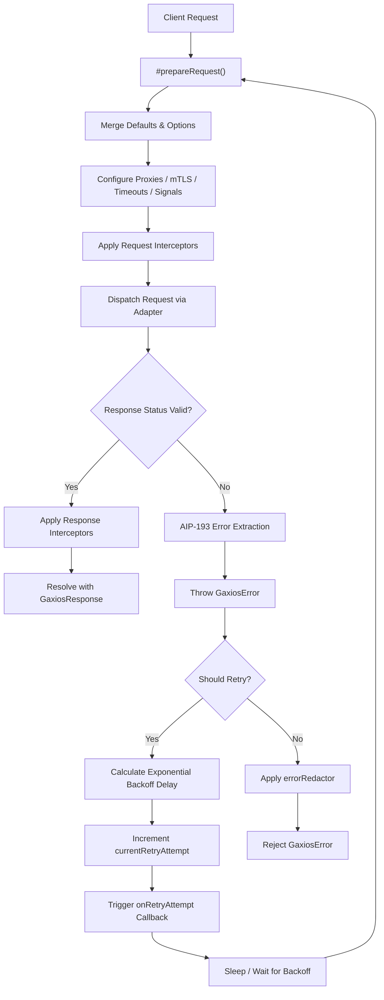

# Gaxios Codebase Metadata & Architecture
# *WARNING*: This file is AI generated and may contain inaccuracies.

Gaxios is a robust HTTP request client for Node.js and browser environments. It provides an `axios`-like developer interface implemented on top of native `fetch` (with a fallback to `node-fetch` in older environments). 

Gaxios is tailored specifically for the Google Cloud Node.js ecosystem (as a core dependency of libraries like `google-auth-library`, `gcp-metadata`, and others). It delivers specialized capabilities for resilient networking, including:
- **Advanced Retries**: Automatic request retries with configurable backoff rules.
- **Exponential Backoff**: Multiplier-driven delay calculation to avoid flooding servers.
- **Interceptors**: Asynchronous hooks for request and response processing.
- **Log Redaction**: Built-in protection against accidental credential leakage in logs.
- **Advanced Agents**: First-class support for HTTP/HTTPS proxies (including wildcard bypass rules) and Mutual TLS (mTLS).

---

## 🏗️ Request & Retry Pipeline Architecture

The diagram below illustrates the lifecycle of an HTTP request made via Gaxios:



---

## 📂 Directory Structure

```
gaxios/
├── src/                # Core implementation source files
├── test/               # Unit tests & testing assets (fixtures)
├── system-test/        # Integration & package installation tests
├── browser-test/       # Browser-level verification tests via Karma
├── utils/              # Build and ESM configuration utilities
└── [configs]           # Build, linting, and formatting configurations
```

---

## 📝 File Registry

### 🚀 Core Source Code (`src/`)

| File | Type | Description |
| :--- | :--- | :--- |
| **[index.ts](src/index.ts)** | Entrypoint | Exposes the primary public API surfaces. Exports classes like `Gaxios`, `GaxiosError`, `GaxiosInterceptorManager` and associated interfaces. Creates and exports the default shared `instance` along with the convenient `request` shorthand. |
| **[common.ts](src/common.ts)** | Types & Errors | Defines types and interfaces (e.g. `GaxiosOptions`, `GaxiosResponse`, `RetryConfig`). Implements `GaxiosError` with support for standard nested `.cause` and `instanceof` checks across library versions. Provides `defaultErrorRedactor` to scrub credentials, tokens, and client secrets from logs. |
| **[gaxios.ts](src/gaxios.ts)** | Core Logic | Implements the central `Gaxios` class. Manages options normalization (`#prepareRequest`), interceptor execution, proxy mapping/exclusions (`#urlMayUseProxy`), mutual TLS (mTLS) setup, and multipart related payloads chunking (`getMultipartRequest`). |
| **[interceptor.ts](src/interceptor.ts)** | Hook System | Defines the `GaxiosInterceptor` hook model and implements `GaxiosInterceptorManager` (inheriting from standard `Set`) to support registering and clearing async request/response handlers. |
| **[retry.ts](src/retry.ts)** | Retry Strategy | Handles retry decision-making (`getRetryConfig`, `shouldRetryRequest`) and calculates delay timings (`getNextRetryDelay`) via multiplier-based exponential backoff, capping at defined limits or timeouts. |
| **[util.cts](src/util.cts)** | Package Utility | A CommonJS script that reads the package `name` and `version` directly from `package.json` to synchronize error markings and metadata. |

---

### 🧪 Unit Tests (`test/`)

Unit tests use [mocha](https://mochajs.org/) as the test runner, [nock](https://github.com/nock/nock) to mock HTTP traffic, and [sinon](https://sinonjs.org/) for mocks and stubs.

| File | Target / Coverage |
| :--- | :--- |
| **[test.index.ts](test/test.index.ts)** | Ensures key exports (`Gaxios`, `GaxiosError`, `GaxiosInterceptorManager`) are successfully resolved from the library package entrypoint. |
| **[test.retry.ts](test/test.retry.ts)** | Exercises the retry and backoff state machine. Tests:<ul><li>Initialization of default retry configurations and status code ranges.</li><li>Rejection of retry behavior on POST requests by default.</li><li>Respecting `AbortSignal` to immediately terminate without retry.</li><li>Configured attempts limits, `noResponseRetries`, and 4xx error bypass.</li><li>Custom synchronous/asynchronous `shouldRetry` and `onRetryAttempt` callback overrides.</li><li>Exponential backoff calculations including `retryDelay`, `retryDelayMultiplier`, `totalTimeout`, and `maxRetryDelay` ceilings.</li></ul> |
| **[test.getch.ts](test/test.getch.ts)** | The central test suite for all core request operations. Tests:<ul><li>Option validation (verifies URL is required).</li><li>Non-2xx HTTP response parsing and AIP-193 JSON error translation into structured errors.</li><li>Custom mock, timing-tracking, and wrapping adapters.</li><li>URL query string formatting (`params`, `paramsSerializer` overrides).</li><li>Proxies and `noProxy` configurations (validates bypass rules against hostnames, origins, wildcards, regular expressions, and comma-separated lists).</li><li>Content formatting including text, JSON, arrays, CSVs, streams, and binary Buffers.</li><li>Automatic log credential redaction (`errorRedactor`) for headers and URL search params.</li><li>Mutual TLS (mTLS) setup and agent caching.</li><li>Asynchronous interceptors registration, lifecycle, order, and cancellation.</li><li>`fetch`-compatible signature mappings.</li></ul> |

#### Test Fixtures (`test/fixtures/`)
- **[fake.cert](test/fixtures/fake.cert)**: A mock SSL certificate used to test Mutual TLS (mTLS) HTTPS agent creation.
- **[fake.key](test/fixtures/fake.key)**: A mock private key used to test Mutual TLS (mTLS) HTTPS agent creation.

---

### 📦 Integration & Installation Tests (`system-test/`)

System tests verify packaging compatibility, dependency structure, and bundler support.

| File / Directory | Description |
| :--- | :--- |
| **[test.install.ts](system-test/test.install.ts)** | Executes a multi-step integration workflow:<ul><li>Packs the library into a `.tgz` archive.</li><li>Spins up a local HTTP server and uses `pack-n-play` to verify Gaxios can be imported and used successfully inside both an **ESM** (`import`) and **CommonJS** (`require`) runtime.</li><li>Creates a temporary sandbox project using `system-test/fixtures/sample`, runs `npm install` on the generated archive, bundles it with webpack, and asserts the compiled payload is valid and under the size limit (256KB).</li></ul> |
| **[system-test/fixtures/sample/](system-test/fixtures/sample/)** | Mock client project containing configuration (`package.json`, `tsconfig.json`), a webpack configuration (`webpack.config.js`), and a source file (`src/index.ts`) importing and initiating a Gaxios request to test build compatibility. |

---

### 💻 Browser Tests (`browser-test/`)

Browser tests confirm execution correctness directly in front-end client contexts.

| File | Description |
| :--- | :--- |
| **[browser-test-runner.ts](browser-test/browser-test-runner.ts)** | Starts a local, CORS-compliant Express server on port `7172` that parses standard GET, query-string, and multipart POST payloads. Automatically runs **Karma** (`karma start`) to run unit tests in a real browser and stops the Express server upon completion. |
| **[test.browser.ts](browser-test/test.browser.ts)** | Contains unit tests executing in the browser via Karma. Asserts that standard requests, query parameters, custom fetch overrides (`window.fetch`), and complex multipart related uploads work natively in browser runtimes. |

---

### 🛠️ Build Utilities (`utils/`)

- **[enable-esm.mjs](utils/enable-esm.mjs)**: A post-build utility script that writes a `{"type": "module"}` manifest inside the `./build/esm/` distribution folder to ensure Node.js interprets target build outputs as ES modules.

---

### ⚙️ Configuration Registry

The root of the package contains multiple configuration files defining the compilation, verification, and style systems:

- **`package.json`**: Lists dependencies, build directives, runtime engines requirements, and CJS/ESM exports paths.
- **`tsconfig.json`**, **`tsconfig.base.json`**, **`tsconfig.cjs.json`**: TypeScript configuration files setting up target definitions and module output generation.
- **`webpack.config.js`**, **`webpack-tests.config.js`**: Webpack compilation rules for bundling Gaxios and its test files.
- **`karma.conf.js`**: Setups browser test engines, plugins, and execution targets.
- **`.compodocrc`**: Directs the Compodoc engine for generating static documentation.
- **`.eslintignore`**, **`.eslintrc.js`**, **`.eslintrc.json`**: ESLint rules and scopes.
- **`.jsdoc.js`**: Configures JSDoc generation.
- **`.mocharc.js`**: Standard runner options for mocha unit tests.
- **`.nycrc`**: NYC coverage thresholds and file inclusions.
- **`.prettierrc.js`**, **`.prettierignore`**: Prettier rules enforcing stylistic alignment with the Google JS Style Guide.
- **`.repo-metadata.json`**: Specifies API classifications, stability level (`stable`), and library categorizations.
- **`linkinator.config.json`**: Configurations for checking and avoiding broken markdown hyperlinks.
