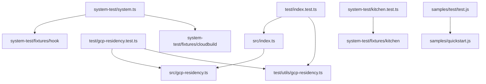

# Codebase Metadata: GCP Metadata Client (`gcp-metadata`)
# *WARNING*: This file is AI generated and may contain inaccuracies.

This directory houses the `@google-cloud/gcp-metadata` (or `gcp-metadata`) package, a lightweight, high-performance Node.js client designed to query the Google Cloud Platform (GCP) Metadata Server.

The GCP Metadata Server is a vital resource when running Node.js workloads inside GCP environments (such as Google Compute Engine, Google Kubernetes Engine, Google Cloud Run, Google Cloud Functions, and Google App Engine). It serves runtime configuration, instance identifiers, service account OAuth tokens, project details, and more.

---

## Architectural Overview & Key Features

1. **Automatic GCP Environment Detection**:
   Automatically probes local host systems, network configurations, and environment variables to deduce if the code is executing on a GCP compute platform.
2. **Optimized Connection Racing**:
   To maximize speed and resilience across varying DNS setups, the library races an IP-based query (`http://169.254.169.254`) against a DNS-based query (`http://metadata.google.internal.`) using `Promise.any`. This prevents unnecessary delays in environments with slow DNS resolution.
3. **Developer-friendly Fail-Fast Locally**:
   If the library detects it is not running on Google Cloud (e.g., on a developer's workstation), it uses a brief 3-second timeout for network checks instead of waiting indefinitely or relying on long OS-level connection timeouts.
4. **High-Precision Large Number Parsing**:
   Employs `json-bigint` to safely parse metadata server JSON responses that contain extremely large numbers (like long GCE project/instance IDs) without loss of precision.
5. **Caching**:
   Memoizes environment detection and metadata server availability checks to reduce redundant HTTP requests and minimize overhead.

---

## Directory Structure & File Map

### 📁 Core Source Files (`src/`)

*   #### **`src/index.ts`**
    *   **Purpose**: The primary API module and client entry point.
    *   **Key APIs**:
        *   `instance<T>(options)`: Fetches metadata for the current Google Compute Engine (GCE) instance.
        *   `project<T>(options)`: Fetches metadata for the current Google Cloud project.
        *   `universe<T>(options)`: Fetches universe-specific settings (e.g. the universe domain).
        *   `bulk(properties)`: Concurrently resolves multiple metadata values via `Promise.all`.
        *   `isAvailable()`: Checks if the metadata server is accessible. Memoizes results and uses connection racing (`Promise.any`) between the IP address (`169.254.169.254`) and DNS address (`metadata.google.internal.`).
        *   `resetIsAvailableCache()`: Utility to clear the memoized availability check cache.
        *   `getGCPResidency()` / `setGCPResidency(value)`: Accesses or overrides cached GCP residency flags.
        *   `requestTimeout()`: Calculates the appropriate query timeout (0ms on GCP, 3000ms locally).
    *   **Technical Details**: Implements custom HTTP options validation, and leverages `json-bigint` for loss-free numeric JSON parsing.

*   #### **`src/gcp-residency.ts`**
    *   **Purpose**: Low-level system and environment analyzer to determine if the runtime platform is GCP.
    *   **Key APIs**:
        *   `isGoogleCloudServerless()`: Inspects process environment variables (`CLOUD_RUN_JOB`, `FUNCTION_NAME`, `K_SERVICE`) to detect Google Cloud Run or older/newer Google Cloud Functions.
        *   `isGoogleComputeEngineLinux()`: Probes Linux DMI tables (specifically `/sys/class/dmi/id/bios_vendor` and `/sys/class/dmi/id/bios_date`) to check if the BIOS vendor matches `Google`.
        *   `isGoogleComputeEngineMACAddress()`: Inspects active local network interface MAC addresses. Returns `true` if any interface's MAC address matches the `/^42:01/` GCE prefix pattern.
        *   `isGoogleComputeEngine()`: Combines the GCE Linux BIOS and GCE MAC address checks.
        *   `detectGCPResidency()`: Master check aggregating serverless and Compute Engine verification.

---

### 📁 Test Files (`test/`)

*   #### **`test/index.test.ts`**
    *   **Purpose**: Comprehensive unit test suite validating all options, query routines, fallback triggers, and environment caching logic in the core index API.
    *   **Coverage**:
        *   *Request/Response validation*: Assures custom query parameters (`params`), custom headers, and paths are generated properly.
        *   *Header Security checks*: Validates that missing or incorrect `Metadata-Flavor: Google` response headers cause expected RangeErrors.
        *   *JSON Parsing*: Ensures high-precision bigints and nested numbers within responses are parsed perfectly using `json-bigint`.
        *   *Local Overrides*: Confirms the client respects custom overrides via `GCE_METADATA_IP`, `GCE_METADATA_HOST`, and `METADATA_SERVER_DETECTION` environment variables.
        *   *Racing & Timeouts*: Simulates various delays and failures between primary and secondary hostnames, proving that `isAvailable()` correctly returns the first successful response and fails fast under heavy network lags.
        *   *Caching*: Confirms `isAvailable()` caches its promise so rapid parallel invocations perform only a single outbound network request.

*   #### **`test/gcp-residency.test.ts`**
    *   **Purpose**: Unit tests focusing entirely on validating the environment analyzer logic inside `gcp-residency.ts`.
    *   **Coverage**:
        *   Tests Cloud Run and Cloud Functions environment detection by mocking process environment variables.
        *   Asserts Linux GCE BIOS file detections by mocking filesystem access and DMI vendor files.
        *   Asserts MAC address verification by mocking the `os.networkInterfaces()` responses to mimic both standard and GCE-prefixed MAC interfaces.

*   #### **`test/utils/gcp-residency.ts`**
    *   **Purpose**: Sandbox helper utility class (`GCPResidencyUtil`) for unit testing.
    *   **Key APIs**:
        *   `setGCENetworkInterface(isGCE)`: Stubs OS network interfaces to provide a mock MAC address.
        *   `setGCEPlatform(platform)`: Stubs OS platform return values.
        *   `setGCELinuxBios(isGCE)`: Stubs filesystem stats and file reads for the Linux DMI/BIOS vendor files.
        *   `removeServerlessEnvironmentVariables()`: Cleans out GCF/Cloud Run variables.
        *   `setNonGCP()`: Utility to stub a complete local machine non-GCP sandbox environment.

---

### 📁 System Tests (`system-test/`)

*   #### **`system-test/system.ts`**
    *   **Purpose**: End-to-end integration tests validating actual connectivity and authenticity against real GCP metadata servers inside active Google Cloud runtimes.
    *   **Coverage**:
        *   *Cloud Functions (Gen 2)*: Dynamically bundles the local package using `npm pack`, copies the package to a function fixture, deploys it using `gcloud functions deploy`, and polls real-time Cloud Logging using `gcloud logging read` to verify the metadata server was detected (`isAvailable=true`).
        *   *Cloud Build*: Uses `gcbuild` to execute a Cloud Build step with a fixture, verifying that the metadata server resolves successfully inside the build environment.
        *   *Pruning / Garbage Collection*: Includes logic to automatically scan and delete old test functions left over from prior test runs, keeping resource usage clean.

*   #### **`system-test/kitchen.test.ts`**
    *   **Purpose**: Packaging and TypeScript compilation sanity test (a "kitchen sink" test).
    *   **Coverage**:
        *   Compresses the codebase into a tarball and copies it to a clean temporary environment containing the `kitchen` TypeScript fixture.
        *   Runs `npm install` and compiles/runs the fixture to verify that downstream applications can successfully consume and reference the compiled type declarations (`.d.ts`) without syntax errors.

---

### 📁 System Test Fixtures (`system-test/fixtures/`)

*   #### **`system-test/fixtures/cloudbuild/`**
    *   `index.js`: Executed inside the mock Cloud Build process. Queries `isAvailable()`, fetches default service account tokens, and reads service account details recursively.
    *   `cloudbuild.yaml`: Defines the steps GCB uses to run the node fixture file.

*   #### **`system-test/fixtures/hook/`**
    *   `index.js`: The entry point script for the GCF deployment test. Exposes the HTTP endpoint `getMetadata` which outputs results of `.isAvailable()`, `.instance()`, and recursive service accounts list.

*   #### **`system-test/fixtures/kitchen/`**
    *   Contains `tsconfig.json` and package configuration to verify downstream type compatibility.

---

### 📁 Samples & Examples (`samples/`)

*   #### **`samples/quickstart.js`**
    *   **Purpose**: Clean, simple example code showcasing how to integrate the library, perform availability checks, and safely fetch instance and project metadata.

*   #### **`samples/test/test.js`**
    *   **Purpose**: Unit/integration test verifying the quickstart sample works as intended.
    *   **Coverage**:
        *   Spins up a local Node.js HTTP server mimicking the metadata server.
        *   Launches `quickstart.js` as a child process, directing it to the mock server via the `GCE_METADATA_HOST` environment variable, and asserts that the stdout output prints "Is available: true".

---

## Configuration & Manifest Files

*   `package.json`: Configures package targets, CommonJS module format, and development scripts (`compile`, `lint`, `test`, `system-test`, `samples-test`).
*   `tsconfig.json`: Configures the TypeScript compilation options.
*   `.mocharc.js`: Specifies test execution configurations for Mocha (timeouts, reporter settings, etc.).
*   `.nycrc` / `c8`: Configuration settings for tracking code coverage percentages.
*   `.eslintrc.js` / `gts`: Standard Google styling and lint configurations.
*   `.jsdoc.js`: Configuration settings for compiling API documentation.
