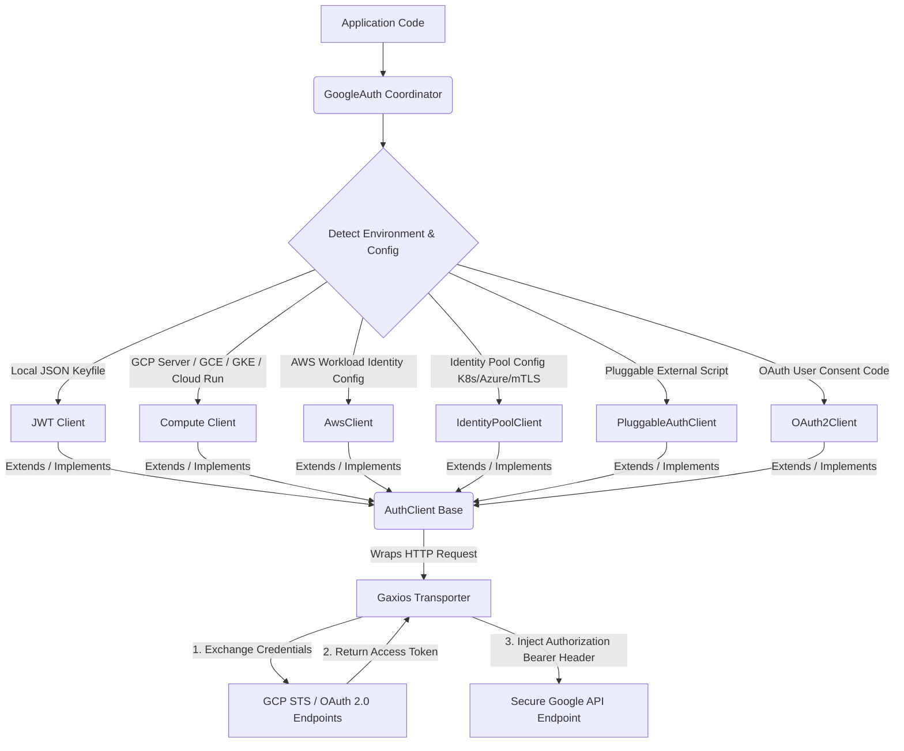

# Google Auth Library for Node.js: Architectural & File Reference
# *WARNING*: This file is AI generated and may contain inaccuracies.

Welcome to the codebase metadata directory reference for the `@google-cloud/auth-library` Node.js client. This document serves as a deep-dive technical onboarding guide and reference, detailing the architecture, flow, inner workings, and test suites of this library.

---

## Table of Contents
1. [Package Purpose & High-Level Architecture](#1-package-purpose--high-level-architecture)
2. [Core Architectural Design Patterns](#2-core-architectural-design-patterns)
3. [A Tour of a Token Request (Execution Flow)](#3-a-tour-of-a-token-request-execution-flow)
4. [Deep Dive: Source Directory Mechanics (`src/`)](#4-deep-dive-source-directory-mechanics-src)
   - [Root Utilities (`src/util.ts`)](#root-utilities-srcutilts)
   - [Cryptographic Adapter Layer (`src/crypto/`)](#cryptographic-adapter-layer-srccrypto)
   - [Service Account Token Engine (`src/gtoken/`)](#service-account-token-engine-srcgtoken)
   - [Identity Federation & STS Layer (`src/auth/`)](#identity-federation--sts-layer-srcauth)
5. [Exhaustive File-by-File Reference](#5-exhaustive-file-by-file-reference)
   - [Root & Core Source Files](#root--core-source-files)
   - [Authentication Clients & Identity Federation (`src/auth/`)](#authentication-clients--identity-federation-srcauth-1)
   - [Cryptographic Interfaces & Implementations (`src/crypto/`)](#cryptographic-interfaces--implementations-srccrypto-1)
   - [Token Caching & Fetching Submodule (`src/gtoken/`)](#token-caching--fetching-submodule-srcgtoken-1)
6. [Testing Mechanics & Test Suites (`test/`)](#6-testing-mechanics--test-suites-test)
   - [Testing Design Patterns](#testing-design-patterns)
   - [Core Library Unit Tests](#core-library-unit-tests)
   - [gtoken Submodule Unit Tests](#gtoken-submodule-unit-tests)
   - [System & Integration Tests (`system-test/`)](#system--integration-tests-system-test)
   - [Browser Tests (`browser-test/`)](#browser-tests-browser-test)

---

## 1. Package Purpose & High-Level Architecture

The `google-auth-library-nodejs` package is the shared authentication layer powering all Google Cloud Platform Node.js clients (e.g., `@google-cloud/storage`, `@google-cloud/pubsub`, and GAPIC-generated libraries). It manages **OAuth 2.0 user consent loops**, **JSON Web Tokens (JWT)**, **Service Accounts**, **Google Compute Engine Serverless Metadata**, and **Identity Federation (Workload & Workforce)**.

The following diagram shows how the central coordinator class (`GoogleAuth`) resolves environmental factors and configures `AuthClient` subclasses:



---

## 2. Core Architectural Design Patterns

The library relies on four key software design patterns:

* **The Transporter Adapter Pattern**: The abstract `AuthClient` class leverages `Gaxios` as its network transporter. It establishes request/response interceptors that inject telemetry, log debugging metrics, and implement exponential backoff retries for temporary network issues.
* **Dynamic Platform Cryptographic Abstraction**: Bridges standard Node.js server runtimes with web browser environments by exposing a single unified `Crypto` interface. An abstract factory (`crypto.ts`) checks environment constraints at startup and swaps between Node's native C++ bindings (`NodeCrypto`) and standard browser-based asynchronous Web Crypto (`BrowserCrypto`).
* **The Supplier Pattern**: Separates discovery of credentials from the token exchange flow. For instance, `SubjectTokenSupplier` abstracts how mTLS certificates, AWS security credentials, or pluggable binary STDOUT values are resolved, making the core exchange logic generic.
* **Environment Discovery Engine**: Pre-configures Application Default Credentials (ADC) using sequential checks across environment variables (`GOOGLE_APPLICATION_CREDENTIALS`), gcloud configuration profiles, and the VM metadata server.

---

## 3. A Tour of a Token Request (Execution Flow)

When an application makes a request to a Google API (e.g., uploading a file to Google Cloud Storage), the library executes the following multi-step sequence under the hood:

### Step 1: Client Selection (The ADC Discovery Phase)
When the user invokes `new GoogleAuth().getClient()`, the library triggers its discovery sequence in `googleauth.ts`:
1. **Environment Variables**: Checks `process.env.GOOGLE_APPLICATION_CREDENTIALS`. If set, it reads the file and invokes `_getApplicationCredentialsFromFilePath`.
   - If the file contains `type: "service_account"`, it instantiates a `JWT` client.
   - If the file contains `type: "external_account"`, it hands the payload to `ExternalAccountClient.fromJSON()`, which returns an `AwsClient`, `IdentityPoolClient`, or `PluggableAuthClient`.
2. **Well-Known Developer Path**: If the environment variable is absent, it looks for a JSON file created by `gcloud auth application-default login`:
   - Linux/Mac: `~/.config/gcloud/application_default_credentials.json`
   - Windows: `%APPDATA%/gcloud/application_default_credentials.json`
3. **Metadata Server**: If no credential file is found, it checks whether it's running on GCP (using the metadata server). If the server is reachable, it instantiates a `Compute` client.
4. **Fail-Safe**: If none of these are found, it throws a `NO_ADC_FOUND` exception.

```
[Application]
      │
      ▼
new GoogleAuth().getClient()
      │
      ├──► 1. Env Var GOOGLE_APPLICATION_CREDENTIALS? ──► Parse file and return client
      │
      ├──► 2. Well-Known Local Developer Credentials? ──► Parse file and return client
      │
      ├──► 3. Running on GCP (Metadata Server)? ────────► Instantiate and return Compute Client
      │
      └──► 4. None? ──────────────────────────────────► Throw "ADC not found" error
```

### Step 2: Request Interception & Telemetry Injection
All requests to Google APIs are routed through `client.request(opts)`. The base `AuthClient` handles request interception:
- Automatically resolves and caches the target domain (e.g. checking if we are executing in the standard `googleapis.com` or custom private VPC networks).
- Injects standard Google telemetry headers (`x-goog-api-client` containing runtime and SDK versions, alongside standard billing project overrides `x-goog-user-project`).

### Step 3: Token Retrieval or Exchange Phase
If no valid access token is cached (or the cached token has expired or is expiring soon), the client triggers its internal token retrieval loop:
* **Service Account / JWT (`jwtclient.ts` / `gtoken`)**: 
  1. Constructs a JSON Web Signature (JWS) claim containing the service account email, requested scopes, audience, and expiry timestamp.
  2. Signs the claim with the service account's private key using the **RS256** algorithm (delegated to the `Crypto` interface).
  3. Sends the signed assertion as an HTTP POST request to `oauth2.googleapis.com/token` to retrieve a fresh OAuth 2.0 access token.
* **Workload Identity Federation (`baseexternalclient.ts` / `stscredentials.ts`)**:
  1. The client resolves a third-party "subject token" (e.g., a Kubernetes Service Account token, an OIDC ID token, an mTLS cert, or an AWS signature).
  2. It bundles this subject token into a standard RFC 8693 Token Exchange request payload (`grant_type=urn:ietf:params:oauth:grant-type:token-exchange`).
  3. Issues an HTTP call to `sts.googleapis.com` to exchange the third-party token for a federated GCP access token.
  4. If a `service_account_impersonation_url` is provided in the configuration, it takes the federated access token and calls the Google `iamcredentials` API to impersonate a target service account, returning the final impersonated token to the caller.
* **Metadata Server (`computeclient.ts`)**:
  1. Queries the local GCE/GKE metadata server at `http://169.254.169.254/computeMetadata/v1/instance/service-accounts/default/token`.
  2. Appends the required `Metadata-Flavor: Google` header.
  3. Parses the returned access token from the JSON response.

### Step 4: Safe Request Replay on Failure
If a request fails due to authentication issues (returning a `401 Unauthorized` or `403 Forbidden`), the `requestAsync` interceptor checks if a token refresh has already been attempted. If not, it clears the cached credentials, requests a new access token, and replays the request once.

---

## 4. Deep Dive: Source Directory Mechanics (`src/`)

### Root Utilities (`src/util.ts`)

#### Normalizing Casing
Configurations provided in JSON files often use `snake_case` (compliant with standard OAuth/Google configurations), while TypeScript classes prefer `camelCase`. `util.ts` provides a custom helper, `originalOrCamelOptions`, which wraps options in a `Map` structure to support lookups using both formats:
```typescript
const opts = originalOrCamelOptions(options);
const tokenUrl = opts.get('token_url'); // will match 'token_url' or 'tokenUrl'
```

#### The Cache System (`LRUCache`)
To avoid redundant token fetches, the library maintains a basic memory-bound Least Recently Used (LRU) cache. Cached objects are automatically pruned when the cache reaches its maximum capacity, ensuring the library uses minimal memory even during high-throughput credential flows.

---

### Cryptographic Adapter Layer (`src/crypto/`)

The cryptographic layer dynamically routes signature and hashing operations depending on the execution environment.

```
               [createCrypto() Factory]
                          │
                 ┌────────┴────────┐
                 ▼                 ▼
        [Browser Environment]   [Node.js Environment]
                 │                 │
                 ▼                 ▼
           BrowserCrypto       NodeCrypto
           (Web Crypto API)   (Native crypto)
```

* **`NodeCrypto`**: Uses the native C++ Node.js `crypto` bindings. Operations such as `verify` and `sign` run synchronously under the hood, but are wrapped in Promises to maintain interface compatibility.
* **`BrowserCrypto`**: Uses the browser's asynchronous `window.crypto.subtle` interface.
  - Since standard PEM private keys are not supported directly by Web Crypto, public key verification is performed by importing certificates formatted as **JSON Web Keys (JWK)**.
  - It uses `base64-js` and native `TextEncoder`/`TextDecoder` structures to handle string/byte array mappings across environments.

---

### Service Account Token Engine (`src/gtoken/`)

`gtoken` is a self-contained token manager focused on service account authorization. It does not inherit from `AuthClient`, making it ideal for lightweight utility scripts or microservices.

* **Preventing Thundering Herds (`tokenHandler.ts`)**: When an access token expires, concurrent API calls could trigger multiple parallel network requests to fetch a new token. `TokenHandler` solves this by caching the in-flight promise (`#pendingToken`). Subsequent callers share the same promise, ensuring only one network request is made:
  ```typescript
  // tokenHandler.ts conceptual structure
  async getToken(forceRefresh: boolean): Promise<TokenData> {
    if (this.token && !this.hasExpired() && !forceRefresh) {
      return this.token;
    }
    if (this.pendingPromise) {
      return this.pendingPromise;
    }
    this.pendingPromise = this.fetchToken();
    try {
      this.token = await this.pendingPromise;
      return this.token;
    } finally {
      this.pendingPromise = null;
    }
  }
  ```
* **JWS Signature Creation (`jwsSign.ts`)**: Builds a JWT assertion by base64url-encoding the header (`{"alg":"RS256","typ":"JWT"}`) and claims, concatenating them with a dot (`.`), and signing the resulting string using the private key and **RS256**.

---

### Identity Federation & STS Layer (`src/auth/`)

Identity Federation allows workloads running outside GCP (e.g., AWS, Azure, Kubernetes) to authenticate to Google APIs without using long-lived Service Account private keys.

#### Base External Client & RFC 8693 Exchange
`BaseExternalAccountClient` coordinates this flow using the GCP Security Token Service (STS):
1. Invokes `retrieveSubjectToken()` (which is implemented by subclasses depending on the environment).
2. Sends an HTTP POST request to `sts.googleapis.com/v1/token` with the following parameters:
   - `grant_type`: `urn:ietf:params:oauth:grant-type:token-exchange`
   - `subject_token`: The resolved identity token.
   - `subject_token_type`: The type of token (e.g. `urn:ietf:params:oauth:token-type:jwt` or `urn:ietf:params:aws:token-type:aws4_request`).
   - `audience`: The fully specified resource path of the workload pool provider.

#### Pluggable Auth Script Executor
For custom hosting environments, users can configure a pluggable executable script. The library spawns this script using `child_process` via `PluggableAuthHandler`:
* **Execution Safety**:
  - Enforces configurable execution timeouts to prevent blocking the application process.
  - Restricts the size of the output read from `stdout` (capping it at 64 KB) to protect against memory exhaustion or Denial of Service (DoS) issues.
  - Validates the script's standard output against a structured JSON schema (`ExecutableResponse`) before passing it to the STS exchange layer.

---

## 5. Exhaustive File-by-File Reference

### Root & Core Source Files

| File | Purpose | Working Mechanics & Structure |
| :--- | :--- | :--- |
| [`index.ts`](src/index.ts) | Public Exports | Re-exports the entire public API surface. Serves as a facade, allowing consumers to import all key classes directly from a single module. |
| [`shared.cts`](src/shared.cts) | Telemetry & Headers | Reads the library version from `package.json` at initialization and exports the standard `USER_AGENT` header template used by Google APIs for telemetry. |
| [`util.ts`](src/util.ts) | Common Utilities | Contains casing normalizers, the memory-cached `LRUCache` implementation, and helper functions to validate local certificate paths. |

### Authentication Clients & Identity Federation (`src/auth/`)

| File | Purpose | Working Mechanics & Structure |
| :--- | :--- | :--- |
| [`authclient.ts`](src/auth/authclient.ts) | Abstract Base Client | Defines the core `AuthClient` class. Implements the default HTTP `request` wrapper, handles retry logic, and manages standard headers (such as `x-goog-user-project` and universe domain verification). |
| [`googleauth.ts`](src/auth/googleauth.ts) | ADC Coordinator | Orchestrates Application Default Credentials (ADC) discovery. Traverses environment variables, local configuration directories, and the metadata server to instantiate the appropriate client. |
| [`credentials.ts`](src/auth/credentials.ts) | Interfaces & Models | Defines core TypeScript interfaces representing access tokens, refresh tokens, service account keys, and external configuration files. |
| [`envDetect.ts`](src/auth/envDetect.ts) | Environment Detection | Checks system environment variables and queries metadata endpoints to determine if the library is running on GCE, GKE, App Engine, or serverless environments. |
| [`baseexternalclient.ts`](src/auth/baseexternalclient.ts) | Identity Federation Base | Coordinates RFC 8693 token exchanges and handles subsequent Service Account impersonation calls via Google's `iamcredentials` API. |
| [`awsclient.ts`](src/auth/awsclient.ts) | AWS Identity Client | Implements `BaseExternalAccountClient` for AWS. Resolves temporary AWS security credentials and generates signed STS requests. |
| [`awsrequestsigner.ts`](src/auth/awsrequestsigner.ts) | AWS Signature V4 Signer | Signs HTTP requests directed to AWS services using the AWS Signature Version 4 signing algorithm, generating standard `Authorization` and `x-amz-date` headers. |
| [`defaultawssecuritycredentialssupplier.ts`](src/auth/defaultawssecuritycredentialssupplier.ts) | AWS Credentials Resolver | Resolves AWS IAM temporary credentials by querying local environment variables or calling the local AWS EC2 instance metadata service. |
| [`identitypoolclient.ts`](src/auth/identitypoolclient.ts) | Workload Identity Client | Implements `BaseExternalAccountClient` for standard OIDC identity pools. Leverages suppliers to load subject tokens from files, URLs, or certificates. |
| [`filesubjecttokensupplier.ts`](src/auth/filesubjecttokensupplier.ts) | File Token Supplier | Implements `SubjectTokenSupplier` to read subject tokens from local text or JSON files (such as Kubernetes projected volumes). |
| [`urlsubjecttokensupplier.ts`](src/auth/urlsubjecttokensupplier.ts) | URL Token Supplier | Implements `SubjectTokenSupplier` to retrieve subject tokens via HTTP GET requests from local service endpoints. |
| [`certificatesubjecttokensupplier.ts`](src/auth/certificatesubjecttokensupplier.ts) | Certificate Token Supplier | Implements `SubjectTokenSupplier` to read and format base64 X.509 client certificates for Mutual TLS (mTLS) flows. |
| [`oauth2client.ts`](src/auth/oauth2client.ts) | OAuth 2.0 User Client | Manages user authorization code loops, exchanges codes for tokens, verifies PKCE challenges, and validates ID token signatures. |
| [`oauth2common.ts`](src/auth/oauth2common.ts) | OAuth Utilities | Provides shared helpers to inject client credentials, format request bodies, and parse standard OAuth HTTP error responses. |
| [`jwtclient.ts`](src/auth/jwtclient.ts) | Service Account JWT Client | Manages Service Account token flows by building self-signed JWT assertions and exchanging them with Google's token endpoint. |
| [`jwtaccess.ts`](src/auth/jwtaccess.ts) | Self-Signed JWT Bearer | Generates signed JWTs that are injected directly as Bearer tokens in outgoing HTTP requests, bypassing the need to exchange them for an access token. |
| [`computeclient.ts`](src/auth/computeclient.ts) | GCE Metadata Client | Queries the local GCP metadata server to retrieve and refresh access tokens for GCE instances and GKE nodes. |
| [`downscopedclient.ts`](src/auth/downscopedclient.ts) | Credential Access Boundary | Interacts with Google's STS to exchange a standard credential for a restricted access token with scoped permissions. |
| [`executable-response.ts`](src/auth/executable-response.ts) | External Script Response | Parses and validates the JSON response returned by pluggable authentication scripts. |
| [`pluggable-auth-client.ts`](src/auth/pluggable-auth-client.ts) | Pluggable Script Client | Implements `BaseExternalAccountClient`. Executes external scripts to retrieve subject tokens and exchanges them with GCP's STS. |
| [`pluggable-auth-handler.ts`](src/auth/pluggable-auth-handler.ts) | Pluggable Process Handler | Spawns child processes to execute pluggable scripts, enforcing timeouts and buffer size limits. |
| [`externalAccountAuthorizedUserClient.ts`](src/auth/externalAccountAuthorizedUserClient.ts) | Federated User Client | Manages long-lived refresh tokens for workforce-federated users, coordinating token exchanges and rotations. |
| [`externalclient.ts`](src/auth/externalclient.ts) | External Client Factory | A static factory that parses external credential configurations and instantiates the correct client subclass. |
| [`idtokenclient.ts`](src/auth/idtokenclient.ts) | ID Token Client | Retrieves OpenID Connect (OIDC) ID tokens from the metadata server or exchanges credentials for them, primarily for service-to-service authentication. |
| [`impersonated.ts`](src/auth/impersonated.ts) | Impersonation Client | Impersonates a target Service Account by exchanging a source credential for an impersonated token via the IAM credentials API. |
| [`iam.ts`](src/auth/iam.ts) | Legacy IAM Headers | Implements a simple wrapper to manually inject Cloud IAM authority headers into outgoing requests. |
| [`loginticket.ts`](src/auth/loginticket.ts) | Decoded OIDC ID Ticket | Parses OIDC ID tokens and exposes their claims (such as user ID, email, and audience) via getter methods. |
| [`refreshclient.ts`](src/auth/refreshclient.ts) | User Refresh Client | Refreshes OAuth 2.0 user credentials using standard long-lived OAuth refresh tokens. |
| [`stscredentials.ts`](src/auth/stscredentials.ts) | STS Token Client | Communicates with Google's Security Token Service (STS) to exchange third-party tokens for GCP access tokens. |
| [`passthrough.ts`](src/auth/passthrough.ts) | No-op Client | A no-op client that forwards requests without adding authentication headers. Useful when connecting to local emulators. |

### Cryptographic Interfaces & Implementations (`src/crypto/`)

| File | Purpose | Working Mechanics & Structure |
| :--- | :--- | :--- |
| [`shared.ts`](src/crypto/shared.ts) | Cryptographic Interface | Defines common cryptographic type signatures and interfaces (hashing, signing, verification) used throughout the library. |
| [`crypto.ts`](src/crypto/crypto.ts) | Cryptographic Factory | Exposes the `createCrypto` factory function, which dynamically instantiates `NodeCrypto` or `BrowserCrypto` based on runtime environment checks. |
| [`node/crypto.ts`](src/crypto/node/crypto.ts) | Node.js Crypto Provider | Implements the `Crypto` interface using native Node.js C++ bindings. Signs assertions and validates certificates. |
| [`browser/crypto.ts`](src/crypto/browser/crypto.ts) | Browser Crypto Provider | Implements the `Crypto` interface using browser Web Crypto (`window.crypto.subtle`) and JSON Web Keys (JWK). |

### Token Caching & Fetching Submodule (`src/gtoken/`)

| File | Purpose | Working Mechanics & Structure |
| :--- | :--- | :--- |
| [`googleToken.ts`](src/gtoken/googleToken.ts) | GToken Entry Point | The public API of the `gtoken` submodule. Wraps `TokenHandler` and exposes simplified token acquisition and revocation methods. |
| [`tokenOptions.ts`](src/gtoken/tokenOptions.ts) | GToken Options | Defines configuration properties for Service Accounts, including private keys, scopes, and transport settings. |
| [`tokenHandler.ts`](src/gtoken/tokenHandler.ts) | Token Handler | Coordinates in-flight promises and caches tokens to prevent parallel token requests (thundering herds). |
| [`getCredentials.ts`](src/gtoken/getCredentials.ts) | Key File Resolver | Resolves private keys from raw configuration files (supporting `.pem`, `.json`, and `.p12` formats). |
| [`jwsSign.ts`](src/gtoken/jwsSign.ts) | JWS Assertion Signer | Signs a base64 JWS assertion with a private key using the RS256 algorithm. |
| [`getToken.ts`](src/gtoken/getToken.ts) | Token HTTP Client | Sends signed JWT assertions as HTTP POST requests to Google's authorization servers. |
| [`revokeToken.ts`](src/gtoken/revokeToken.ts) | Token Revocation | Sends an HTTP request to Google's revocation endpoint to invalidate active tokens. |
| [`errorWithCode.ts`](src/gtoken/errorWithCode.ts) | Custom Error | Defines a custom error class that bundles descriptive messages with alphanumeric error codes. |

---

## 6. Testing Mechanics & Test Suites (`test/`)

### Testing Design Patterns

* **Fake Timers Sandbox**: Token expiration logic is time-sensitive. Using real timeouts in tests would cause delays and slow down the suite. The tests use `sinon.useFakeTimers` to simulate the passage of time, allowing them to verify expiration and refresh logic instantly:
  ```typescript
  const clock = sinon.useFakeTimers();
  // ... initiate cached token ...
  clock.tick(3600 * 1000); // fast-forward 1 hour
  assert.ok(client.isTokenExpiring());
  clock.restore();
  ```
* **HTTP Network Mocking (`nock`)**: To prevent the tests from making real network requests to Google API endpoints, the suite uses `nock` to intercept and mock HTTP calls. This allows the tests to assert that the correct request payloads, headers, and query parameters are sent:
  ```typescript
  nock('https://oauth2.googleapis.com')
    .post('/token')
    .reply(200, {
      access_token: 'mock-access-token',
      expires_in: 3600,
    });
  ```

### Core Library Unit Tests

| File | Targets & Test Coverage |
| :--- | :--- |
| [`test.authclient.ts`](test/test.authclient.ts) | Verifies `AuthClient` default properties, request interceptors, quota project propagation, and method-level call logging. |
| [`test.googleauth.ts`](test/test.googleauth.ts) | Tests the ADC discovery chain, verifying correct resolution order across environment paths and well-known local files. |
| [`test.oauth2.ts`](test/test.oauth2.ts) | Tests user consent loops, authorization code exchanges, PKCE verifications, refresh loops, and event emissions. |
| [`test.oauth2common.ts`](test/test.oauth2common.ts) | Asserts base64 URL formatting, error payload mapping, and common header injection logic. |
| [`test.jwt.ts`](test/test.jwt.ts) | Verifies the `JWT` client, checking key file parsing, RS256 signature generation, and token caching behaviors. |
| [`test.jwtaccess.ts`](test/test.jwtaccess.ts) | Tests self-signed JWT bearer token generation, asserting that correct claims and audiences are signed. |
| [`test.compute.ts`](test/test.compute.ts) | Mocks the GCE metadata server to test token retrieval, ID token fetching, and error wrapping for 403/404 responses. |
| [`test.downscopedclient.ts`](test/test.downscopedclient.ts) | Asserts that the `DownscopedClient` correctly serializes Credential Access Boundary (CAB) rules during token exchanges. |
| [`test.baseexternalclient.ts`](test/test.baseexternalclient.ts) | Verifies the base identity federation logic, including STS exchanges, process retries, and concurrent request caching. |
| [`test.awsclient.ts`](test/test.awsclient.ts) | Mocks AWS IMDSv2 endpoints to test regional STS exchanges and token exchanges. |
| [`test.awsrequestsigner.ts`](test/test.awsrequestsigner.ts) | Compares calculated AWS Signature Version 4 hashes and query parameters against expected AWS test suites. |
| [`test.identitypoolclient.ts`](test/test.identitypoolclient.ts) | Verifies identity pool configurations, testing subject token retrieval from files, URLs, and certificates. |
| [`test.executableresponse.ts`](test/test.executableresponse.ts) | Asserts that the library correctly handles malformed JSON or missing fields in pluggable executable output. |
| [`test.pluggableauthclient.ts`](test/test.pluggableauthclient.ts) | Mocks pluggable commands and verifies that the returned subject token is exchanged with the GCP STS endpoint. |
| [`test.pluggableauthhandler.ts`](test/test.pluggableauthhandler.ts) | Verifies command execution, checking that process timeouts, buffer size limits, and error outputs are handled correctly. |
| [`test.externalclient.ts`](test/test.externalclient.ts) | Exercises the `ExternalAccountClient` factory to confirm it instantiates the correct client subclass from JSON configurations. |
| [`test.externalaccountauthorizeduserclient.ts`](test/test.externalaccountauthorizeduserclient.ts) | Tests federated user token rotations and refresh token updates. |
| [`test.idtokenclient.ts`](test/test.idtokenclient.ts) | Verifies that serverless service-to-service ID tokens are retrieved and refreshed correctly. |
| [`test.impersonated.ts`](test/test.impersonated.ts) | Tests Service Account impersonation, verifying that the library requests tokens with the correct scopes and lifetime parameters. |
| [`test.refresh.ts`](test/test.refresh.ts) | Tests user credential refreshing using mock OAuth refresh token exchanges. |
| [`test.stscredentials.ts`](test/test.stscredentials.ts) | Verifies that raw STS token exchange requests are constructed and serialized correctly. |
| [`test.passthroughclient.ts`](test/test.passthroughclient.ts) | Confirms that the no-op client forwards request headers without modifying them. |
| [`test.crypto.ts`](test/test.crypto.ts) | Verifies cryptographic operations (hashing, signing, and verification) using the `NodeCrypto` provider. |
| [`test.loginticket.ts`](test/test.loginticket.ts) | Checks that decoded login ticket claims are exposed correctly via getter methods. |
| [`test.iam.ts`](test/test.iam.ts) | Verifies that the legacy IAM client correctly injects headers into outgoing requests. |
| [`test.util.ts`](test/test.util.ts) | Tests core utilities, including LRU caching and casing conversions. |
| [`test.index.ts`](test/test.index.ts) | Verifies that all public API surfaces are exported correctly from the library's entry point. |

### gtoken Submodule Unit Tests

| File | Targets & Test Coverage |
| :--- | :--- |
| [`test.googleToken.ts`](test/gtoken/test.googleToken.ts) | Verifies GToken token acquisition, caching, and revocation flows. |
| [`test.tokenHandler.ts`](test/gtoken/test.tokenHandler.ts) | Tests eager token refreshes, clock offsets, and concurrent promise caching. |
| [`test.getCredentials.ts`](test/gtoken/test.getCredentials.ts) | Verifies key file parsing for `.json`, `.pem`, and `.p12` formats. |
| [`test.jwsSign.ts`](test/gtoken/test.jwsSign.ts) | Asserts that RS256 JWT assertions are signed and formatted correctly. |
| [`test.getToken.ts`](test/gtoken/test.getToken.ts) | Mocks Google's token servers to verify response error handling. |
| [`test.revokeToken.ts`](test/gtoken/test.revokeToken.ts) | Verifies that token revocation requests are sent correctly. |
| [`test.errorWithCode.ts`](test/gtoken/test.errorWithCode.ts) | Ensures custom errors expose error codes alongside standard descriptive messages. |

---

## 5. System & Integration Tests (`system-test/`)

System tests verify package compiling and live environment execution.

* **[`test.kitchen.ts`](system-test/test.kitchen.ts)**:
  - **How it works**: Creates a temporary testing environment and bundles the library using standard production package configurations.
  - **What it asserts**: Verifies that the bundled library builds and compiles under standard consumer TypeScript configurations, checking that all exported types resolve correctly without runtime errors.

---

## 6. Browser Tests (`browser-test/`)

Browser tests run inside a headless browser environment to verify cross-platform compatibility.

* **[`test.crypto.ts`](browser-test/test.crypto.ts)**:
  - **How it works**: Executes cryptographic operations inside the browser runtime.
  - **What it asserts**: Verifies that `BrowserCrypto` (using the browser's Web Crypto API) successfully performs SHA-256 hashing and RS256 signatures, producing identical results to Node's native C++ crypto implementation.
* **[`test.oauth2.ts`](browser-test/test.oauth2.ts)**:
  - **How it works**: Simulates OAuth flows inside the browser runtime.
  - **What it asserts**: Verifies that PKCE verifiers, state challenges, and authorization URL configurations compile and run smoothly in browser-based applications.
