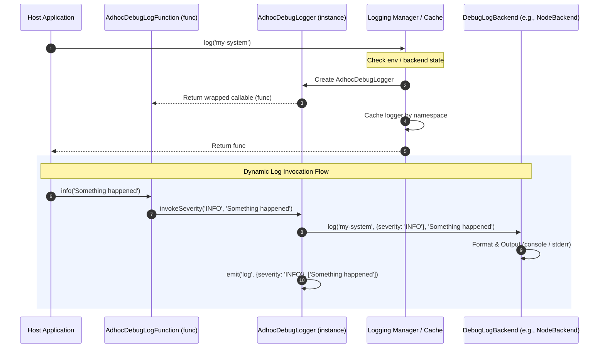

# google-logging-utils Architecture Guide
# *WARNING*: This file is AI generated and may contain inaccuracies.

Welcome to the architectural reference and code tour for `google-logging-utils` (npm package: `google-logging-utils`). 

This package is a lightweight, highly-optimized, zero-dependency (excluding dev dependencies) logging utility used internally by other Google Cloud Node.js client libraries (such as `@google-cloud/pubsub`) to manage diagnostic, debug, and structured trace logging.

---

## 🎯 Core Purpose & Design Philosophy

The core philosophy of `google-logging-utils` is to provide a flexible and powerful ad-hoc diagnostic logging layer that is **completely unobtrusive** in production and **extremely rich** when enabled.

Key architectural goals include:
1. **Zero Runtime Overhead when Disabled**: If diagnostic logging is not explicitly enabled via environment variables or manual configuration, calling `log()` resolves to a static, pre-instantiated placeholder function with zero memory or CPU overhead. No loggers are allocated in memory.
2. **Event-Driven Observability**: Every active logger instance acts as an `EventEmitter`. This allows libraries or host applications to dynamically "tap" into diagnostic logs by listening to the `'log'` event, facilitating custom ingestion or local diagnostic streams.
3. **Dynamic Hot-Swapping**: Loggers are decoupled from their actual stdout/stderr emitters (backends). Developers can hot-swap backends globally at runtime (e.g., switching from plain text to Google Cloud Structured JSON logging) without losing previously registered event listeners.
4. **Zero Production Dependencies**: To minimize the package foot-print and prevent dependency conflicts in user applications, all terminal colorization and temporal helpers are built from scratch without pulling in external libraries.

---

## 🧱 System Architecture & Design Patterns

### 1. The Dynamic Backend Bridge


### 2. Architecture Patterns in Action

#### The Placeholder Pattern (Zero-Overhead Fallback)
If neither the global `cachedBackend` nor the environment variable `GOOGLE_SDK_NODE_LOGGING` are present, `log()` immediately returns a pre-created, no-op logger `placeholder` instead of compiling regexes, reading environment flags, or allocating a new class.

#### The Self-Referential Function Pattern
An `AdhocDebugLogFunction` returned by `log()` is both a **callable function** (for simple logs) and an **object/class** that exposes methods and events. 
```typescript
const debug = log('pubsub');

// Callable style (default severity)
debug({other: {foo: 'bar'}}, 'Initiating connection');

// Severity method style
debug.info('Connected!');
debug.error('Failed to connect');

// Event emitter style
debug.on('log', (fields, args) => {
  console.log('Tapped diagnostic line:', args);
});
```

#### The Sub-Logger Pattern
Using `debug.sublog('connection')` creates a child logger. The system automatically propagates namespaces hierarchically by concatenating them with a colon (`pubsub:connection`), which allows fine-grained regex filtering.

---

## 📂 Directory & File Tour

Here is an overview of all key files within `core/packages/logging-utils`:

| File Path | Role | Core Responsibility |
| :--- | :--- | :--- |
| **`src/index.ts`** | Entrypoint | Defines public exports, including all logging factory helpers and interfaces. |
| **`src/types.ts`** | Domain Types | Declares the core enums, types, and functional interfaces representing log fields, severities, and pluggable backends. |
| **`src/colours.ts`** | Terminal Styling | Implements a robust, dependency-free ANSI terminal color detector and colorizer inspired by Node's internal utility. |
| **`src/temporal.ts`** | Time Utils | Implements a simplified, TC39-compliant shim for managing durations and milliseconds without external dependencies. |
| **`src/logging-utils.ts`** | Logging Orchestration | The heartbeat of the library. Manages namespaces, registry caching, environment filtering, and pluggable backend implementations. |
| **`test/logging-utils.ts`** | Unit Tests | Validates logging behavior, filter regex parsing, structured JSON formatting, event tapping, and caching. |
| **`test/temporal.ts`** | Unit Tests | Assures correctness of the TC39 `Duration` polyfill across multiple time units. |
| **`samples/system-test/test.quickstart.ts`** | Integration Test | Runs quickstart samples inside isolated child processes to ensure environment flag routing works. |

---

## 🔍 Detailed Module Walkthrough

### 1. `src/index.ts`
A simple entrypoint that re-exports all symbols from `logging-utils` and exposes selected types from `types.ts`.

---

### 2. `src/types.ts`
Declares the core data contracts for the library:
- **`LogSeverity`**: An enum defining GCP-compatible log severities (`DEFAULT`, `DEBUG`, `INFO`, `WARNING`, `ERROR`).
- **`LogFields`**: The metadata envelope that can contain OpenTelemetry details (`telemetryTraceId`, `telemetrySpanId`), `severity`, and a catch-all `other` field for custom structured metadata.
- **`AdhocDebugLogFunction`**: The hybrid interface returned to users. It can be directly invoked as a function, has methods for severities (`.info()`, `.warn()`, etc.), manages child namespaces (`.sublog()`), and implements standard `EventEmitter` `.on('log')` subscriptions.
- **`DebugLogBackend`**: The interface that pluggable log targets must implement, consisting of `log()` and `setFilters()`.

---

### 3. `src/colours.ts`
Terminal styling is critical for developer logs, but importing third-party color libraries (`colors`, `chalk`, etc.) bloats dependencies. `colours.ts` implements a localized `Colours` helper:
- **TTY & Capability Detection**: Uses `tty.WriteStream.isTTY` and `getColorDepth()` to dynamically check if terminal outputs support colourization.
- **Fallback Handling**: If the target stream is not a TTY or has insufficient color depth, colors are disabled by substituting ANSI sequences with empty strings (`''`).
- **ANSI Sequence Mapping**: Provides standard escape codes for terminal color styling (`red`, `green`, `yellow`, `blue`, `magenta`, `cyan`, `white`, `grey`, `dim`, `bright`, `reset`).

---

### 4. `src/temporal.ts`
This file bridges the gap until the **TC39 Temporal** specification becomes native across all supported Node.js runtimes.
- **`Duration` Class**: An immutable class wrapping a private `millis` value.
- **`Duration.from(DurationLike)`**: Safely builds a duration from objects containing fractional hours, minutes, seconds, or milliseconds (e.g., `{ minutes: 30 }`).
- **`totalOf(TotalOfUnit)`**: Converts a stored duration back into a floating-point representation of a requested unit (e.g. converting a 90-minute duration to `1.5` hours or `90` minutes).

> [!NOTE]
> Since polyfills are often heavy or contain runtime compatibility bugs on legacy Node versions, this highly-simplified shim provides only the exact subset of `Temporal.Duration` required by client libraries, keeping the runtime bundle size small.

---

### 5. `src/logging-utils.ts`
The primary core module implementing all logical operations:

#### `AdhocDebugLogger`
A class extending `EventEmitter` that binds log invocations to dynamic targets. It sets up convenience methods (`.debug`, `.info`, `.warn`, `.error`) and handles exception safety. If an upstream backend or a custom event subscriber throws an error during execution, the exception is caught and swallowed to guarantee logging never disrupts the host application.

#### `DebugLogBackendBase`
The abstract base class that manages namespace filters. It parses the filter configuration string provided in the `GOOGLE_SDK_NODE_LOGGING` environment variable (comma-separated namespaces, allowing wildcard `*` symbols).

#### Pluggable Backends
1. **`NodeBackend`**: The default, highly-optimized text backend. It prints logs to `console.error` formatting each line as:
   `[Process ID] [Namespace | Severity] [Message] [Metadata JSON]`
   It dynamically applies terminal colors to severity tags and metadata if color capabilities are enabled.
2. **`DebugBackend`**: A bridge adapter for applications already using the npm `debug` package, allowing unified filtering through `NODE_DEBUG`.
3. **`StructuredBackend`**: Adapts logs into standard JSON matching Google Cloud's structured logging specifications:
   ```json
   {
     "severity": "INFO",
     "message": "Formated log message",
     "telemetryTraceId": "xyz...",
     "other": { "extra": "metadata" }
   }
   ```
   Logs can be written to standard out or forwarded to an upstream backend.

#### Registry and Lifecycle Management
- **`loggerCache`**: Tracks all active loggers by namespace. This guarantees that if multiple modules request `log('pubsub:connection')`, they receive the exact same instance, keeping event listeners intact.
- **`setBackend(backend)`**: Replaces the global backend on-the-fly and flushes the logger cache to ensure that subsequent calls utilize the new logging sink configuration.

---

## 🧪 Testing Suite Details

The library contains unit tests and sample system tests to verify the correctness and resilience of the logging layer.

### 1. Unit Tests (`test/temporal.ts`)
Verifies the TC39-like `Duration` utility:
- Confirms `Duration.from()` handles various combinations of time values (e.g., creation from milliseconds, seconds, minutes, or hours).
- Verifies that `totalOf()` performs precise floating-point math when converting back to individual units.

### 2. Unit Tests (`test/logging-utils.ts`)
Provides extensive functional coverage for the core logging architecture using a custom `TestSink` test mock:
- **Disabled State Verification**: Asserts that logging is completely silent when no enabling environment flags are defined.
- **Environment Parsing**: Validates that the `GOOGLE_SDK_NODE_LOGGING` variable accepts wildcards, specific systems, and handles alias variables (like `all` mapping to `*`).
- **Manual Backends**: Confirms that configuring `setBackend(sink)` manually works independently of environment flags.
- **Severity & Direct Invocation**: Tests all direct logging styles (e.g., calling `logger()`, `logger.info()`, etc.) and validates metadata values.
- **Instance Caching**: Verifies that identical namespaces resolve to the exact same object instance (`logger === logger2`).
- **Event Tapping**: Validates the `EventEmitter` functionality by checking that custom listeners receive `'log'` event envelopes correctly.
- **Structured Logs**: Tests the structured JSON output format, stubbing standard console methods with `sinon` to assert matching ingestion keys.
- **Hierarchy**: Tests that `logger.sublog('subsys')` prefixes namespaces correctly and routes records through the system hierarchy.

---

## 🚀 Sample and System-Test Integration

To see `google-logging-utils` in action, we can review the packaged sample applications under the `samples/` directory.

### Quickstart Script (`samples/typescript/quickstart.ts`)
Illustrates how libraries incorporate the utility:
```typescript
import {log} from 'google-logging-utils';

function main() {
  // Obtain a namespaced logger
  const test = log('testing');
  
  // Structured logging with metadata
  test({other: {foo: 'bar'}}, 'boo');
  
  // Severity logging
  test.info('info');
}

main();
```

### System Test Integration (`samples/system-test/test.quickstart.ts`)
This system test ensures that logs behave appropriately under real-world executions by spawning separate Node processes via `child_process.execSync`:
1. **Quiet Execution Test**:
   Executes the quickstart sample in an environment *lacking* the `GOOGLE_SDK_NODE_LOGGING` variable. Asserts that the output is completely clean and that no log statements are printed to stdout/stderr.
2. **Verbose Execution Test**:
   Executes the quickstart sample with the environment variable `GOOGLE_SDK_NODE_LOGGING=all`. Asserts that colorized debug logs containing severity tags and structured metadata (`foo: 'bar'`) are successfully written to terminal outputs.
