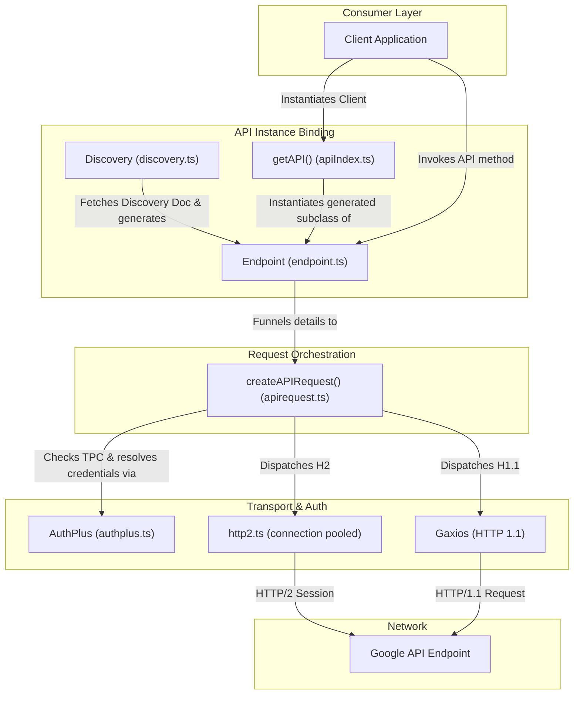

# GoogleAPIs Common (`googleapis-common`) Package Architecture Reference
# *WARNING*: This file is AI generated and may contain inaccuracies.

The `googleapis-common` package (`@google-cloud/googleapis-common`) is a core internal shared tooling library utilized extensively by `googleapis` and other Google API client libraries. 

> [!NOTE]
> As stated in its description, this is a helper package and is not intended for direct end-user/consumer consumption. It acts as the engine room for generated clients, providing unified configuration, dynamic API generation, request orchestration, authentication hooks, Trusted Partner Cloud (TPC) universe domain routing, and an experimental HTTP/2 connection-pooling transport layer.

---

## 1. Core Architecture & Design Patterns

The package operates as a bridge between standard HTTP client utilities (like `gaxios`), authentication frameworks (`google-auth-library`), and API definitions (Google Discovery Documents). Below is the system-level architecture:



### Main Architectural Pillar Patterns:
1. **Dynamic API Discovery & Client Binding**: By loading or fetching JSON Google Discovery Documents, the `Discovery` and `Endpoint` classes dynamically construct nested resource namespaces and construct executable JavaScript methods on the fly.
2. **Universal Request Orchestrator**: The core `createAPIRequest` function handles parameter mapping (e.g., aliased keyword parameters), required argument validations, URL-template expansions, custom query serialization, multipart/related file upload stream-tracking, and credentials mapping.
3. **Trusted Partner Cloud (TPC) Universe Domains**: Dynamically intercepts target URLs to map Google API requests to customized partner cloud environments based on environment variables or custom library options, enforcing validation policies to prevent credential leakage between separate universes.
4. **Experimental HTTP/2 Connection Pooling**: Implements a custom lightweight HTTP/2 client featuring automated host connection pooling, proactive inactive session teardown timeouts, and stream-based data buffering.

---

## 2. Package Directory Tour & Execution Flow

When a client invokes a method on an instantiated Google API service, the execution flows through the following components:

```
[Client Call]
     │
     ▼
[Endpoint.makeMethod()] ──► Compiles parameter lists, defines method URLs, and checks upload capabilities.
     │
     ▼
[createAPIRequest()]    ──► Merges options, checks required params, resolves TPC domains, converts headers,
     │                      and formats browser vs. Node stream/multipart payloads.
     ▼
  (http2?)
   ├──► [Yes] ──────────► Resolves auth headers ──► [http2.request()] ──► Reuses pooled h2 connection.
   └──► [No]  ──────────► [authClient.request() or new Gaxios().request()].
```

---

## 3. Source Code Files (`src/`)

### [index.ts](index.ts)
- **Purpose**: The primary library entrypoint that aggregates and re-exports all public interfaces, classes, helper utilities, and crucial external dependency types (from `google-auth-library` and `gaxios`).

### [api.ts](api.ts)
- **Purpose**: Hosts standard TypeScript interfaces and type declarations describing request configurations, option configurations, and service metadata.
- **Key Elements**:
  - `APIRequestParams`: Holds parameter bags, path parameter lists, required parameter checks, context references, and optional media links.
  - `GlobalOptions` & `MethodOptions`: Extends standard `gaxios` options to specify API versions, target URLs, authentication credentials, and universe domain overrides.
  - `UserAgentDirective`: Models the product name, version, and comments needed to format custom `User-Agent` header lines.
  - `BodyResponseCallback`: Signature for classic Node-style callback invocations.

### [apiIndex.ts](apiIndex.ts)
- **Purpose**: Provides the `getAPI` engine instantiation factory function.
- **How it works**: Client modules pass the target API name, options/version, version registry mapping, and global context. `getAPI` resolves the designated version class constructor, instantiates the class with specified options, freezes the resulting object via `Object.freeze` to prevent runtime mutations, and returns it.

### [apirequest.ts](apirequest.ts)
- **Purpose**: The central operational heart of the package, responsible for processing and dispatching API requests.
- **How it works**:
  - Deep-merges local request parameters, API service-level options, and global Google configurations.
  - Normalizes parameters; specifically, fields clashing with JS/TS reserved keywords (which generated clients suffix with an underscore like `resource_`) have their trailing underscore stripped.
  - Resolves the request body, supporting legacy `resource` parameters and modern `requestBody` conventions.
  - Performs required parameter validation and expands path/URL templates using `url-template`.
  - Custom-serializes arrays in the querystring using `qs` in a repeating fashion (`a=1&a=2`) and replaces `+` characters with `%20` encoding.
  - Handles TPC Universe domain routing, replacing `.googleapis.com` host suffixes if custom domains are resolved, and cross-validates credential metadata against the target universe to prevent token leaks.
  - Processes media/multipart uploads; for Node.js, it builds stream-based `multipart/related` payloads tracked via `ProgressStream` transforms to notify consumers of upload progress. For browsers, it formats and submits memory-bound string buffers.
  - Adds mandatory instrumentation headers (`x-goog-api-client`, `x-goog-api-version`).
  - Dispatches the request using either experimental `http2.request`, authenticated `authClient.request`, or standalone `Gaxios.request`.

### [authplus.ts](authplus.ts)
- **Purpose**: Wraps `GoogleAuth` from `google-auth-library` to provide a unified authentication constructor class (`AuthPlus`).
- **How it works**: Exposes core auth client classes (like `JWT`, `Compute`, `OAuth2Client`, etc.) directly on the class instance. It overrides `getClient()` and `getProjectId()` to keep a cached memo of the most recently generated authentication instance, ensuring that subsequent calls resolve project IDs within the same credential context.

### [discovery.ts](discovery.ts)
- **Purpose**: Manages runtime API client generation from Google Discovery Documents.
- **How it works**:
  - Fetches Discovery Document schemas dynamically from remote discovery URL endpoints or reads them from the local filesystem if no protocol prefix exists.
  - Leverages `makeEndpoint` to produce dynamic `Endpoint` factory instantiators and uses `applySchema` to map the schema's API layout dynamically into executable namespaces in memory.
  - Offers `discoverAllAPIs` to fetch a root registry list and construct a frozen version-keyed client dictionary.

### [endpoint.ts](endpoint.ts)
- **Purpose**: The base class for dynamic API namespaces and endpoints.
- **How it works**:
  - Provides `applySchema()`, which recursively navigates a discovery document's nested resources and method trees, binding them to the target class instance.
  - Binds resource methods using `makeMethod()`. When executed, `makeMethod` compiles parameter collections, identifies URL path variables, identifies media upload options, and delegates execution to `createAPIRequest()`.

### [http2.ts](http2.ts)
- **Purpose**: An experimental HTTP/2 network client layer designed to support high-throughput, low-latency multiplexed API requests.
- **How it works**:
  - Manages a connection registry (`sessions`) keyed by hostname to pool active `ClientHttp2Session` connections.
  - Auto-cleans idle connections using a `500ms` timeout delay following request completion, releasing file descriptors to let Node.js processes terminate gracefully.
  - Maps request configurations to HTTP/2 pseudo-headers (`:path`, `:method`), writes stream, string, or JSON payloads, handles automatic GZIP gunzipping, and validates response status codes.
  - Automatically evicts pooled sessions from cache if they trigger `'error'` or `'goaway'` events.

### [isbrowser.ts](isbrowser.ts)
- **Purpose**: Simple helper returning a boolean reflecting whether the script runs inside a web browser context (`typeof window !== 'undefined'`) vs. a Node.js process.

### [schema.ts](schema.ts)
- **Purpose**: Contains exhaustive type definitions and interfaces representing Google APIs Discovery Service schemas (e.g., `Schemas`, `SchemaItem`, `SchemaParameter`, `SchemaMethod`).

### [util.ts](util.ts)
- **Purpose**: General utility and translation layer for headers and responses.
- **Key Elements**:
  - `headersToClassicHeaders`: Converts browser standard `Headers` objects or `Array` key-value lists into plain `Record<string, string>` key-value dictionaries.
  - `marshallGaxiosResponse`: Reformats response metadata from `Gaxios` to expose a standard, writable, and classic HTTP/2-friendly header object representation.

---

## 4. Unit Test Files (`test/`)

The unit testing strategy verifies component isolation, option-merging policies, mock discovery document binding, and transport flows using `nock` (to mock network transactions) and `proxyquire` (to mock module dependencies).

### [test.api.ts](test/test.api.ts)
- **What is tested**: Validates basic exports and structural validation of interfaces.
- **Strategy**: Basic import checking.

### [test.apiIndex.ts](test/test.apiIndex.ts)
- **What is tested**: Dynamic engine instantiation inside `getAPI`.
- **Strategy**:
  - Asserts that providing just a version string successfully instantiates the endpoint class.
  - Asserts that version parameter keys are successfully deleted from configuration parameter objects before construction.
  - Asserts that invalid argument inputs throw runtime exceptions, and constructors triggering internal exceptions surface proper error envelopes.

### [test.apirequest.ts](test/test.apirequest.ts)
- **What is tested**: Thorough, exhaustive unit coverage of the `createAPIRequest` orchestration engine.
- **Strategy & Mocking**:
  - Enforces network isolation using `nock.disableNetConnect()`.
  - Implements `FakeReadable` (simulating custom chunks) and `FakeWritable` (verifying multipart boundaries and tracking upload progress) to validate Node.js stream progress reporting.
- **Key Assertions**:
  - Verifies parameter resolution; specifically, that non-required `resource` payloads are treated as bodies, while required string resources successfully parse into URL query options.
  - Validates `userAgentDirectives` formatting at local, service, and global configuration tiers.
  - Validates URL root rewriting logic.
  - Asserts that `Accept-Encoding: gzip` and instrumentation client headers (`x-goog-api-client`, `x-goog-api-version`) populate correctly.
  - Validates the Trusted Partner Cloud (TPC) Universe domain translation workflow: translating hosts to custom domains, preventing leaking credentials across separate universes, and prioritizing manual parameters over environment variables.

### [test.authplus.ts](test/test.authplus.ts)
- **What is tested**: Class bindings and client retrieval in `AuthPlus`.
- **Strategy**: Leverages `proxyquire` to intercept `'google-auth-library'` and supply stubbed auth client returns to verify correct property exposure and credential instantiation.

### [test.discovery.ts](test/test.discovery.ts)
- **What is tested**: API client construction from discovery documents.
- **Strategy**: Uses `nock` to mock remote schema document requests, loading local JSON fixtures (like `compute-v1.json`) to assert that the generated client parses resource paths and binds dynamic fields (such as `zones`) on newly initialized endpoints.

### [test.endpoint.ts](test/test.endpoint.ts)
- **What is tested**: Constructor option localizing and dynamic schema binding on base `Endpoint` instances.
- **Strategy**: Feeds fixture schemas to `applySchema` and asserts that endpoint methods (like `list`) compile into executable JS functions on target objects.

### [test.http2.ts](test/test.http2.ts)
- **What is tested**: The experimental HTTP/2 connection pooling and network stack.
- **Strategy**:
  - Employs `proxyquire` to intercept the native `'http2'` module and stub the `connect` handler.
  - Returns a `FakeClient` subclassing `EventEmitter` that yields a customizable request duplex stream (`requestStream`).
- **Key Assertions**:
  - Asserts HTTP/2 pseudo-header mapping and default GZIP decoding.
  - Asserts that host connections are cached in the pooled registry and automatically cleared after the designated idle timeout.
  - Verifies session eviction policies upon triggering stream errors or receiving server `goaway` packets.
  - Asserts correct transmission of string, stream, and object bodies.

### [test.isbrowser.ts](test/test.isbrowser.ts)
- **What is tested**: Validates that `isBrowser` yields `false` in standard Node.js test environments.

### [test.schema.ts](test/test.schema.ts)
- **What is tested**: Import check verifying types schema exports.

### [test.util.ts](test/test.util.ts)
- **What is tested**: Helper methods in `util.ts`.
- **Strategy**: Asserts correct plain-object translation of `Headers` class instances, and validates that Gaxios response mapping yields writable classic headers while preserving status codes.

---

## 5. Browser Tests (`browser-test/`)

### [test.isbrowser.ts](browser-test/test.isbrowser.ts)
- **Purpose**: Verifies that when compiled and run inside a real browser context (using Karma/Chrome/Firefox via the Webpack configuration), `isBrowser()` correctly evaluates to `true`.

---

## 6. Samples Tests (`samples-test/`)

### [samples.test.ts](samples-test/samples.test.ts)
- **Purpose**: Placeholder warning test. Since this is a core internal developer helper package, it does not provide public consumption samples; hence, this prints a warning informing the runner that no sample tests are configured.

---

## 7. System Tests (`system-test/`)

System tests assert correct live integration behavior against real Google Cloud Platform services in the cloud, demanding actual Google Cloud credentials to execute successfully.

### [test.http2.ts](system-test/test.http2.ts)
- **What is tested**: Asserts that experimental HTTP/2 requests function reliably against actual live production Google services.
- **Strategy**:
  - Uses authentic GCP service credentials.
  - Performs real Cloud Storage bucket list requests (`https://storage.googleapis.com/storage/v1/b`) and asserts data resolution.
  - Performs translation calls using Google Translation API POST requests.
  - Performs multi-part stream uploads of string chunks to Google Cloud Storage, subsequently cleaning up by invoking live HTTP/2 DELETE commands on the created resources.

### [test.kitchen.ts](system-test/test.kitchen.ts)
- **What is tested**: Module packaging, installation compatibility, and bundling integrity.
- **Strategy**:
  - Leverages standard GCP tooling package testing (often known as "kitchen sink" tests).
  - Generates a package release archive tarball using `npm pack`.
  - Moves the tarball to a temporary directory, copying a clean mock consumer test app (`system-test/fixtures/kitchen`) along with it.
  - Executes `npm install` in the temp path to assert dependency resolution succeeds without error.
  - Compiles the application using Webpack to assert browser compilation compatibility and validates that the resulting minified browser bundle size is well within parameters (under 400KB).

---

## 8. Benchmarks (`benchmark/`)

### [bench.ts](benchmark/bench.ts)
- **Purpose**: Compares request completion speed between standard HTTP/1.1 and experimental multiplexed HTTP/2.
- **How it works**: Stubbing auth header requirements, it fires 50 concurrent requests against Google's Discovery API endpoint over both protocols, printing out individual latency records and computing the average transaction duration for each layer to evaluate H2 efficiency gains.
