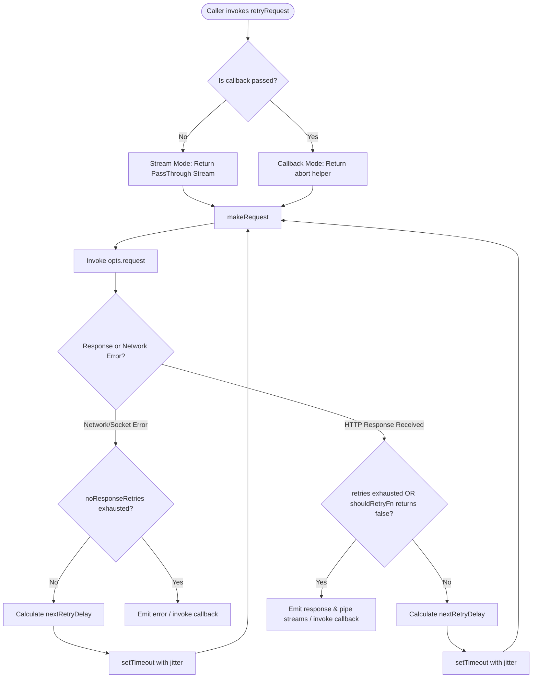

# 🛠️ retry-request Architectural Reference
# *WARNING*: This file is AI generated and may contain inaccuracies.

This document serves as a comprehensive technical reference and architectural walkthrough for the `@google-cloud/retry-request` package. It details the library's core purpose, internal execution paths, design decisions, individual files, and test coverage.

> [!IMPORTANT]
> **Deprecation Warning:** As of July 2024, this repository and package are deprecated. Relevant retry functionalities have been consolidated into [gaxios](https://github.com/googleapis/gaxios).

---

## 📖 Overview & Purpose

The `@google-cloud/retry-request` package provides a lightweight, flexible HTTP request wrapper that automatically retries transient failures using exponential backoff and randomized jitter. 

Key features include:
- **Decoupled Design:** It does not ship with a built-in HTTP client. Instead, it delegates request execution to an injected HTTP request function (e.g., `teeny-request` or `request`).
- **Dual-Mode API:** Operates seamlessly in both **Callback** and **Readable Stream** modes, automatically aligning with the interface of standard HTTP client streams.
- **Smart Retry Policies:** Distinguishes between transport/network errors (no response received) and HTTP status code failures (e.g., `429 Too Many Requests`, `5xx Server Errors`).
- **Capped Exponential Backoff with Jitter:** Automatically introduces randomized jitter to avoid thundering herd problems and ensures retries respect both maximum delay boundaries and total call deadlines.

---

## 🔄 Architectural Workflow

The following diagram details how a request traverses `retry-request`, highlighting the differences between callback and stream modes, error handling, and backoff calculation.



---

## 🗺️ Codebase Tour & Core Mechanics

`retry-request` is a compact package comprising only a single source file, a TypeScript type declaration file, and a comprehensive unit test suite. 

### 1. Execution Modes
The library checks the signature of the call to determine the execution mode:
* **Callback Mode:** If a function is passed as the last argument, the library wraps the call. It returns an object exposing an `abort()` function that forwards calls directly to the underlying active request.
* **Stream Mode:** If no callback is provided, it instantiates and returns a Node.js `PassThrough` stream. Because HTTP request streams start writing payload data as soon as they connect, `retry-request` pipes the internal request stream to a temporary `delayStream`. If a retry is triggered, this stream is discarded and a new request is initiated. If the request succeeds or retries are exhausted, the buffered data in the `delayStream` is piped forward to the main `retryStream`.

### 2. Error Categories
The library separates failures into two categories:
* **Network Failures (No HTTP Response):** DNS errors, network dropouts, or connection socket hangups. Regulated by `opts.noResponseRetries` (default is `2`).
* **HTTP Status Failures:** Successful connections that returned an HTTP response. The `opts.shouldRetryFn` determines whether to retry (defaults to retrying `1xx`, `429`, and `5xx` codes). Regulated by `opts.retries` (default is `2`).

### 3. Exponential Backoff & Jitter Calculation
Exponential backoff prevents slamming servers with repeated retries. The delay for retry number $N$ is computed as:

$$\text{Delay} = (\text{retryDelayMultiplier}^{N} \times 1000) + \text{jitter}$$

* **Jitter:** A random integer between `0` and `999` milliseconds.
* **Max Delay Cap:** The calculated delay is capped at `opts.maxRetryDelay` (default is `64` seconds).
* **Deadline Cap:** To prevent calls from stalling forever, the delay is shortened or cancelled if it would cause the total request lifecycle to exceed `opts.totalTimeout` (default is `600` seconds).

---

## 🗂️ File-by-File Technical Breakdown

The package contains the following files:

| File Name | Purpose | Key Implementations / Structures |
| :--- | :--- | :--- |
| [index.js](index.js) | Primary Source Code | `retryRequest()`, `getNextRetryDelay()`, `DEFAULTS` |
| [index.d.ts](index.d.ts) | TypeScript Declaration File | Module type signatures and interfaces |
| [package.json](package.json) | Dependency & Scripts Definition | Versioning, runtime scripts, dependencies |
| [test.js](test.js) | Unit Test Suite | Stream, callback, overriding, and backoff tests |

---

### 1. [index.js](index.js)

Contains the core algorithm and orchestrates the request/retry flows.

#### Global State & Configurations
* **`DEFAULTS`:** An object defining fallback configurations:
  ```js
  {
    objectMode: false,
    retries: 2,
    maxRetryDelay: 64,       // Capped maximum retry delay (seconds)
    retryDelayMultiplier: 2, // Multiplier base for exponential backoff
    totalTimeout: 600,       // Hard limit for the overall operation duration (seconds)
    noResponseRetries: 2,    // Retries for transport errors
    currentRetryAttempt: 0,
    shouldRetryFn: (response) => { ... } // Returns true for 1xx, 429, and 5xx status codes
  }
  ```

#### Primary Functions
* **`retryRequest(requestOpts, opts, callback)`**
  * Determines callback vs. stream mode based on arguments.
  * Normalizes options, extending user configurations over `DEFAULTS`.
  * Validates that `opts.request` is provided (throwing an error if missing).
  * Orchestrates the request cycles using several inner helper functions:
    * `resetStreams()`: Cleans up request streams and aborts active request instances to prevent memory/socket leaks.
    * `makeRequest()`: Creates the request. In stream mode, it sets up a temporary `PassThrough` (`delayStream`) and registers event listeners (`error`, `response`, `complete`, `finish`) on the underlying active stream. In callback mode, it executes `opts.request(requestOpts, onResponse)`.
    * `retryAfterDelay(currentRetryAttempt)`: Calculates the next sleep interval and schedules `makeRequest` via `setTimeout`.
    * `onResponse(err, response, body)`: The core evaluation function. Analyzes whether the call failed or succeeded, checks retry thresholds, and either schedules a retry or propagates the result to the user.

* **`getNextRetryDelay(config)`**
  * The standalone backoff calculation helper. Takes `maxRetryDelay`, `retryDelayMultiplier`, `retryNumber`, `timeOfFirstRequest`, and `totalTimeout` parameters.
  * Uses `Math.pow(retryDelayMultiplier, retryNumber)` multiplied by `1000` plus a random jitter up to `1000ms`.
  * Computes the absolute maximum allowed delay based on the deadline `totalTimeoutMs - (Date.now() - timeOfFirstRequest)`.
  * Caps the result to the lowest value among the calculated exponential delay, the deadline remaining time, and `maxRetryDelayMs`.

---

### 2. [index.d.ts](index.d.ts)

Provides accurate TypeScript typings for users of the library.

* **Features:**
  * Imports types from `request` and `teeny-request`.
  * Exposes function overloads representing the optional `opts` and `callback` signatures.
  * Defines the interface `retryRequest.Options`, detailing all configurable properties like `shouldRetryFn`, `retries`, `maxRetryDelay`, and customizable request functions.

---

### 3. [package.json](package.json)

Defines dependencies, packaging outputs, engine requirements, and scripts.

* **Key Details:**
  * **Runtime Engines:** Requires Node.js version `>=18`.
  * **Dependencies:** Relies strictly on `extend` (for deep-copy options extending) and `teeny-request` (as the modern default request executor).
  * **Package Files:** Restricts publication strictly to `index.js`, `index.d.ts`, and `license` to keep the footprint minimal.
  * **No System Tests:** The package contains no integration or system tests. The `system-test` script runs `"echo no system test"`.

---

## 🧪 Unit Tests Breakdown: [test.js](test.js)

The unit test suite uses `mocha` as its test framework, `assert` for assertions, and `teeny-request` to simulate request flows.

The tests are split into five logically isolated groups:

### Group 1: Streams (`describe('streams')`)
Validates streaming request behaviors:
* **`works with defaults in a stream`**: Verifies that making a default streaming request to a `404` URL succeeds, emits a `'response'` event, and completes cleanly.
* **`allows object mode`**: Ensures that setting `objectMode: true` successfully initializes the underlying `PassThrough` stream's internal state with object support.
* **`emits an error`**: Asserts that socket errors (e.g., DNS lookup failure on non-existent host) bubble up as `'error'` events on the stream.
* **`emits a 'request' event on each request`**: Mocks an HTTP request stream to assert that a `'request'` event is fired on every retry attempt, allowing users to monitor retries.
* **`exposes an 'abort' function to match request`**: Verifies that the returned stream implements a functional `abort()` method.
* **`works on the last attempt`**: Simulates a sequence where the first two attempts return a `503` but the third succeeds (`200`). Verifies that the internal aborts occurred on the failed request streams, and the final response triggers `'complete'`.
* **`never succeeds`**: Simulates a stream that returns `503` indefinitely. Asserts that when all retries are exhausted, the `'response'` event is emitted representing the final failed status.
* **`forwards a request error`**: Ensures that a post-response error emitted on the request stream is forwarded through to the main `retryStream`'s `'error'` listener.

### Group 2: Callbacks (`describe('callbacks')`)
Validates request behaviors when a callback function is supplied:
* **`works with defaults with a callback`**: Asserts standard out-of-the-box functionality for callback execution on a standard HTTP request.
* **`exposes an 'abort' function`**: Verifies that in callback mode, `retryRequest` returns an object containing an `abort()` method, which delegates abortion down to the active request instance.
* **`returns an error`**: Verifies that network-level connection drops are passed as the first argument (`err`) to the user callback.

### Group 3: Configuration Overrides (`describe('overriding')`)
Ensures all parameters can be customized or safely defaulted:
* **`should ignore undefined options`**: Verifies that passing `undefined` values inside the options object does not overwrite properties; standard defaults are utilized instead.
* **`should allow overriding retries`**: Sets `retries: 0` and asserts that no second attempts are made.
* **`should use default noResponseRetries`**: Verifies that default connection/socket retries operate when no override is supplied.
* **`should allow overriding noResponseRetries`**: Overrides `noResponseRetries: 0` and verifies that connection failures are immediately propagated without retrying.
* **`should allow overriding currentRetryAttempt`**: Sets `currentRetryAttempt: 1` and asserts that the retry offset decreases the remaining retry allowance.
* **`should allow overriding shouldRetryFn`**: Customizes the retry decision function to confirm it overrides the default HTTP status code checker.
* **`should allow overriding request`**: Validates that a completely custom request function can be injected.

### Group 4: Default Retry Rules (`describe('shouldRetryFn')`)
Validates the default HTTP status code retry logic:
* **`should retry a 1xx code`**: Verifies that all informational status codes (`100` to `199`) trigger retries.
* **`should not retry a 2xx code`**: Verifies that all success codes (`200` to `299`) bypass retries.
* **`should not retry a 3xx code`**: Verifies that redirect codes (`300` to `399`) bypass retries.
* **`should not retry a 4xx code`**: Verifies that most client error codes (`400` to `499`, excluding `429`) bypass retries.
* **`should retry a 429 code`**: Asserts that status `429` (`Too Many Requests`) triggers a retry.
* **`should retry a 5xx code`**: Asserts that all server errors (`500` to `599`) trigger retries.

### Group 5: Time Delay Mechanics (`describe('getNextRetryDelay')`)
Verifies the delay calculation mathematics:
* **`should return exponential retry delay`**: Asserts that delays are calculated exponentially and stay strictly within computed boundary bounds ($2^N$ seconds plus $0-1000$ms jitter).
* **`should allow overriding the multiplier`**: Asserts that a customized `retryDelayMultiplier` is correctly integrated into the calculation.
* **`should honor total timeout setting`**: Asserts that if a request has been running and the overall deadline (`totalTimeout`) is approaching, the calculation limits the delay time to fit inside the remaining window rather than throwing an out-of-bounds delay.
* **`should return maxRetryDelay if calculated retry would be too high`**: Asserts that delays are capped by `maxRetryDelay` (both default and custom overridden values) to prevent massive delay times.
