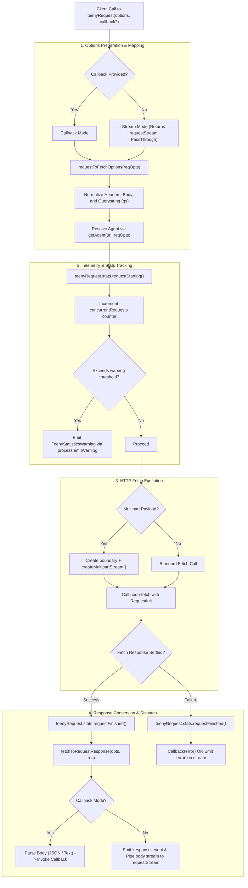

# 🌌 Teeny-Request Package Architecture
# *WARNING*: This file is AI generated and may contain inaccuracies.

`teeny-request` is a lightweight, modern wrapper built around `node-fetch` that mimics the API surface of the legacy and deprecated `request` library. Because many Google Cloud client libraries historically relied on `request`'s configuration schema, `teeny-request` was created as a drop-in alternative to minimize package weight while preserving backward-compatible streaming, callback patterns, proxy configurations, and connection pooling.

---

## 🏗️ High-Level Conceptual Flow

The execution path of a request flows through options mapping, proxy/connection pooling agent resolution, stats telemetry, and stream/callback dispatch:



---

## 📁 Directory Structure & Component Summary

```
teeny-request/
├── src/
│   ├── index.ts             # Main entrypoint, Request options normalizer, & core fetching logic
│   ├── agents.ts            # Connection pool caching, Proxy agent resolution, & NO_PROXY filters
│   └── TeenyStatistics.ts   # Concurrency tracker & threshold violation warnings emitter
└── test/
    ├── index.ts             # End-to-end request mocks, callback/stream, and body type unit tests
    ├── agents.ts            # Proxy configurations, NO_PROXY bypass patterns, & keepAlive caching tests
    └── TeenyStatistics.ts   # Stats increment/decrement & emitWarning threshold tests
```

---

## 🛠️ Detailed Tour of Source Code (`src/`)

### 1. [src/index.ts](src/index.ts)
This file acts as the primary coordinator of the library. It exposes the main `teenyRequest` function, its defaults factory, and maps request configurations to the corresponding fetch parameters.

*   **`requestToFetchOptions(reqOpts: Options)`**: Converts legacy `request` options into standard `node-fetch` `RequestInit` parameters.
    *   Translates `reqOpts.method` (default `GET`), `reqOpts.timeout` to `timeout`, and `reqOpts.gzip` to fetch `compress`.
    *   Maps request bodies: automatically serializes `json` options as strings and sets `Content-Type: application/json`, or processes binary buffers and regular strings directly.
    *   Handles query strings: if `useQuerystring` or `qs` is passed, it uses Node's `querystring` module to append parameters safely to the URI.
    *   Resolves the network agent using `getAgent(uri, reqOpts)`.
*   **`fetchToRequestResponse(opts: RequestInit, res: Response)`**: Normalizes the native fetch Response into a backward-compatible structure. It maps request parameters, formats headers back into an object (from fetch's `Headers` map), and sets standard response values.
*   **`createMultipartStream(boundary, multipart)`**: Generates a multipart/related request stream. Used primarily for file uploads (combining metadata JSON and media streams).
*   **`teenyRequest(reqOpts, callback?)`**: Directs request execution based on usage:
    *   *Multipart Mode*: Handles two-part uploads asynchronously.
    *   *Stream Mode (no callback)*: Instantiates a `stream-events` `PassThrough` stream, deferring data piping until the user sets up a reader (`reading` event), ensuring no chunk is lost.
    *   *Callback Mode (with callback)*: Initiates the fetch request, handles HTTP status code `204` gracefully, automatically parses `application/json` or falls back to raw text, and triggers the callback.
*   **`teenyRequest.defaults(defaults)`**: Returns a pre-configured wrapper around `teenyRequest` to apply common configurations (e.g., timeouts, headers) across multiple calls.
*   **`teenyRequest.stats` & `teenyRequest.resetStats()`**: Exposes the package's telemetry tracking instance.

### 2. [src/agents.ts](src/agents.ts)
This file is responsible for optimizing connections, pooling sockets, and managing network proxies.

*   **`pool`**: A `Map<string, HTTPAgent>` that caches created HTTP/HTTPS agents to keep connections alive and avoid socket overhead.
*   **`shouldUseProxyForURI(uri)`**: Resolves environmental proxy settings. It reads `NO_PROXY`/`no_proxy` environment variables, supports comma-separated exclusion domains and wildcard domains (`*.example.com`, `.example.com`), and filters requests accordingly.
*   **`getAgent(uri, reqOpts)`**: Returns the appropriate connection agent:
    *   If a proxy is defined (`reqOpts.proxy` or proxy environment variables) and the destination URI is not filtered by `NO_PROXY`, it dynamically imports and returns an instance of `http-proxy-agent` or `https-proxy-agent`.
    *   If `reqOpts.forever` is active, it returns or initializes a cached `http.Agent` or `https.Agent` with `keepAlive: true` from the global `pool` (respecting customized socket parameters in `reqOpts.pool`).
    *   Otherwise, it returns `undefined`, causing `node-fetch` to rely on default system agents.

### 3. [src/TeenyStatistics.ts](src/TeenyStatistics.ts)
This file prevents resource leaks or thread pool exhaustion from uncontrolled outbound network requests.

*   **`TeenyStatistics`**: Monitors concurrent request volumes.
    *   **`requestStarting()`**: Increments the `concurrentRequests` counter. If the count crosses the warning threshold, it creates a `TeenyStatisticsWarning` and logs it exactly once via `process.emitWarning()`.
    *   **`requestFinished()`**: Decrements the active request counter.
*   **Warning Threshold Configuration Precedence**:
    1.  Direct option configuration via `concurrentRequests` passed to constructor/options (setting `0` completely disables warnings).
    2.  The `TEENY_REQUEST_WARN_CONCURRENT_REQUESTS` environment variable.
    3.  The built-in fallback default of **5000** concurrent requests.

---

## 🧪 Detailed Tour of Test Suite (`test/`)

All tests are implemented using **Mocha** as the runner, **Sinon** for mock/stub sandboxing, and **Nock** to intercept real HTTP network connections.

### 1. [test/index.ts](ctest/index.ts)
Contains unit tests verifying request dispatching, streams, header mapping, and body parsing configurations.

*   **JSON & Request Options Resolution**: Checks if requests retrieve JSON properly and validates option forwarding in `teenyRequest.defaults`.
*   **Header Mapping & Fetch Format compatibility**: Validates that the response event object and its headers align with legacy `request` formats. Tests integration with standard browser-style `Headers` objects.
*   **Error Handling**: Assures that parser errors (e.g. invalid JSON payloads) are passed directly to the caller instead of being silently dropped or over-wrapped.
*   **Stream Handling & Stream Pipes**:
    *   Verifies that stream mode exposes a valid `PassThrough` stream.
    *   Validates integration with stream orchestration utilities like `pumpify` (testing `setEncoding('utf8')` and async iteration).
    *   Verifies that response streams are not piped to the user stream until the user requests it (`data` listener or pipe setup), preventing memory/buffer issues.
*   **Agent & Proxy Injection**: Assures that the `forever` keepAlive configuration correctly creates an agent and that proxy settings are correctly resolved on the dynamic agent structure.
*   **Body Parsing**: Confirms the handler supports binary `Buffer`, string payloads, and JSON inputs.
*   **Telemetry Integrations**: Verifies stats tracking calls `requestStarting` and `requestFinished` under success and failure outcomes across callback, stream, and multipart request modes.

### 2. [test/agents.ts](ctest/agents.ts)
Contains unit tests for the socket pooling, agent caching, and environment proxy filters.

*   **Default Agent**: Confirms `undefined` is returned if no special options are set.
*   **Proxy Agent Generation**: Asserts that explicit request proxy values or proxy environment variables (`http_proxy`, `https_proxy`, etc.) correctly generate instances of `HttpProxyAgent` or `HttpsProxyAgent`.
*   **`no_proxy` and `NO_PROXY` Filters**: Asserts that proxy exclusions bypass the proxies, returning `undefined` instead. Explicitly tests wildcard matches (`*.domain`), dotted subdomains (`.domain`), list separations (`domain-a,domain-b`), and combinations thereof.
*   **Keep-Alive Caching (`forever`)**: Asserts that `forever: true` produces a pooled HTTP/HTTPS agent, and verifies that subsequent calls return the exact same agent reference (avoiding new socket allocations).
*   **Connection Pool Options**: Verifies that configurations under `reqOpts.pool` (like `maxSockets`) are correctly forwarded to the agent instances instead of leaking into or modifying global agents.

### 3. [test/TeenyStatistics.ts](ctest/TeenyStatistics.ts)
Tests the telemetry thresholds and concurrency warnings behavior.

*   **Constructor & Config Precedence**: Validates the priority order (constructor options > environment variables > default `5000` value).
*   **Options Mutators**: Verifies that `getOptions()` returns copies of state to prevent unexpected external mutations, and tests `setOptions()` resets.
*   **Concurrency Counters**: Confirms that the active request counter increments on `requestStarting()` and decrements on `requestFinished()`.
*   **Threshold Warning Triggering**:
    *   Verifies that exceeding the threshold triggers a `TeenyStatisticsWarning` through `process.emitWarning`.
    *   Verifies that warnings are emitted exactly once, avoiding console log pollution.
    *   Tests "yo-yoing" scenarios where active requests drop back below the threshold and rise again, assuring that warnings are not re-emitted.
    *   Validates the specific warning message and metadata contents (value, threshold, type).

---

## 🌐 Integration & System Testing

As specified in [package.json](cpackage.json#L21):
```json
"system-test": "echo no system test"
```
There is **no direct integration/system test suite** within this folder. This is a deliberate design choice. `teeny-request` is a low-level dependency wrapper. It is integration-tested downstream, directly powered by the integration suites of the heavy libraries that depend on it (such as `@google-cloud/common`, `@google-cloud/storage`, etc.). Ensuring its unit tests cover all options combinations with precise HTTP mocking (`nock`) guarantees stability.
