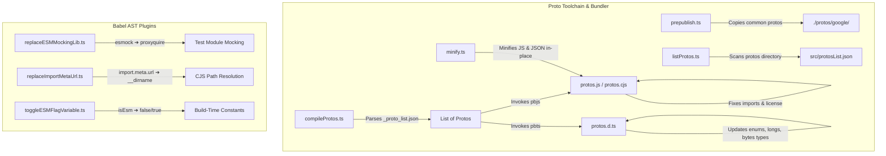

# GAPIC Tools (`gapic-tools`) Technical Architecture Reference
# *WARNING*: This file is AI generated and may contain inaccuracies.

Welcome to the technical architectural guide for `gapic-tools` (located at `core/packages/tools`). This package provides essential build utilities, protobuf compilation pipelines, and Babel-based transpilation plugins used across the `google-cloud-node` client libraries.

---

## 📖 Table of Contents
1. [Overview & Purpose](#-overview--purpose)
2. [High-Level Architecture](#-high-level-architecture)
3. [The Code Tour: Source Code Walkthrough](#-the-code-tour-source-code-walkthrough)
4. [The Code Tour: Test Suite Walkthrough](#-the-code-tour-test-suite-walkthrough)
5. [How to Run and Dev](#-how-to-run-and-dev)

---

## 🌟 Overview & Purpose

The `gapic-tools` package contains a set of specialized command-line interface (CLI) tools and Babel AST plugins designed to automate the packaging and building of Google Cloud Client libraries. 

Its primary duties are:
1. **Protobuf Compilation & Optimization:** Resolving `.proto` files, compiling them into unified static Javascript modules (`.js`, `.cjs`), generating corresponding TypeScript definitions (`.d.ts`), and post-processing the outputs (such as JSDoc formatting and type loosening).
2. **Asset Packaging:** Minifying generated protobuf formats and localizing/bundling common Google APIs protobuf files (`google/api/*`, `google/iam/*`, etc.) so that the library is fully self-contained before publishing.
3. **ESM and CommonJS Dual-Targeting & Mocking Conversion:** Facilitating codebases targeting both CommonJS (CJS) and EcmaScript Modules (ESM) via custom Babel AST transformations that toggle ESM flags, replace ESM-specific path resolvers with CJS equivalents, and rewrite module mocking imports (`esmock` to `proxyquire`).

---

## 📐 High-Level Architecture

The toolchain is split into two logical functional components:



---

## 🚶 The Code Tour: Source Code Walkthrough

Here is an itemized breakdown of every source file in `src/`, detailing what it does, how it does it, and its role in the ecosystem.

### 1. `src/compileProtos.ts`
* **Purpose:** Compiles Google API proto files listed under JSON files matching `*_proto_list.json` into static JavaScript modules (`.js` and `.cjs`), generates `.d.ts` typings, and sanitizes/normalizes imports and typings.
* **Execution CLI Name:** `compileProtos`
* **How it works:**
  1. Scans input directories recursively for `_proto_list.json` files.
  2. Parses these JSON lists to obtain exact paths to the proto files, adding common Google GAX protos path dependencies automatically.
  3. Executes the `protobufjs-cli/pbjs` tool programmatically to compile the proto files to a static module (JSON or JS formats).
  4. Modifies the generated JS/CJS files using string replacements to re-export the `protobufjs/minimal` runtime via the `google-gax` library (preventing duplicate runtime definitions and keeping dependencies minimal).
  5. Programmatically executes the `pbts` CLI to convert the generated JS file into TypeScript definitions (`.d.ts`).
  6. Modifies the output `.d.ts` definitions in-place to support highly flexible types:
     - Relaxes **Enums** so that fields typed as enums can accept both enum numeric values or their string representation keys (e.g., `enumField: E | keyof typeof E`).
     - Relaxes **Bytes** so that they accept `Uint8Array | Buffer | string` (allowing base64 encoded representations).
     - Relaxes **Longs** (Int64) so that they accept `number | Long | string` (allowing string representation of huge numbers).
     - Adapts the imports (`import Long = require("long")`) to resolve cross-module issues.

### 2. `src/listProtos.ts`
* **Purpose:** Automatically indexes all `.proto` files inside a library's `protos` folder and writes them to a JSON index catalog.
* **Execution CLI Name:** `listProtos`
* **How it works:**
  - Synchronously walks the specified `protos` directory.
  - Filters and maps all files ending with `.proto`.
  - Outputs the catalog as a formatted JSON array into `src/protosList.json` within the targeted package. This is typically loaded at runtime by the gRPC client to map schema locations.

### 3. `src/minify.ts`
* **Purpose:** Minifies static protobuf output assets (`.json` and `.js` files) to reduce package size and bundle size for target runtimes.
* **Execution CLI Name:** `minifyProtoJson`
* **How it works:**
  - Scans files in `build/protos` or a custom folder.
  - Uses `uglify-js` to shrink the content.
  - > [!NOTE]
    > For `.json` files, it uses specific minify settings (`expression: true`, `compress: false`, `output.quote_keys: true`) so that it strips all indentation and newlines but leaves it a syntactically valid, parsable JSON string.
    > For `.js` files, it runs typical minification.

### 4. `src/prepublish.ts`
* **Purpose:** Downloads/bundles common Google proto dependencies into the package's local build before publishing.
* **Execution CLI Name:** `prepublishProtos`
* **How it works:**
  - Deletes and recreates the `./protos/google` subfolder.
  - Obtains paths to Google's common proto files (`api`, `iam/v1`, `logging/type`, `monitoring/v3`, `longrunning`, `protobuf`, `rpc`, `type`, `cloud/location`) using the package `google-proto-files`.
  - Copies these directories into the target library's `./protos/google` path so that the client library does not depend on external filesystem layouts at runtime.

### 5. `src/replaceESMMockingLib.ts`
* **Purpose:** A Babel plugin designed to convert ES modules dynamic mocking libraries to CommonJS mocking libraries during dual-module test suite transformations.
* **How it works:**
  - Acts as a custom Babel visitor plugin.
  - **Imports:** Rewrites imports matching the source value `fromLibName` (default `esmock`) to import from `toLibName` (default `proxyquire`).
  - **Call Expressions:** Intercepts call expressions where the callee identifier is `esmock`. It swaps the callee target to `proxyquire` and updates parent AST nodes appropriately.

### 6. `src/replaceImportMetaUrl.ts`
* **Purpose:** A Babel plugin converting ESM path/directory resolution statements to CJS counterparts.
* **How it works:**
  - Searches for the specific ESM AST pattern: `path.dirname(fileURLToPath(import.meta.url))`.
  - Converts the entire statement into a replacement variable AST node, which is configured to `__dirname` by default.

### 7. `src/toggleESMFlagVariable.ts`
* **Purpose:** A Babel plugin that allows toggle/injection of compile-time boolean constants (e.g., `const isEsm = true;` ➔ `const isEsm = false;`) during bundle conversions.
* **How it works:**
  - Targets `VariableDeclarator` nodes.
  - Matches variable names configured by the user (default: `isEsm`).
  - If the initialized value is a boolean literal, it updates that boolean value dynamically (default: `false`).

---

## 🧪 The Code Tour: Test Suite Walkthrough

All files under `test/` are granular unit tests written in TypeScript, executed via **Mocha**, using **c8** for coverage analysis. 

> [!IMPORTANT]
> **Note regarding System Tests:** There are **no system-test or integration-test files** in this package. All verification is done via highly detailed unit tests that run on mock files and AST constructs. The `package.json` system-test script is intentionally configured to `echo 'no system-test'`.

Here is the exact breakdown of each unit test suite:

### 1. `test/compileProtos.ts`
* **Tests:** `src/compileProtos.ts`
* **What it validates:**
  - **Isolation & Safety:** Copies fixture files (`test/fixtures/*`) into a temporary isolated sandbox `.compileProtos-test` for each test, runs compilation within that directory, and cleans it up afterwards to avoid environment pollution.
  - **GAX Path Integration:** Verifies that the default `gaxProtos` is correctly resolving to standard Google proto structures inside node modules.
  - **Standard Compilation Pipeline:** Runs compilation on test directories, asserting that the program outputs valid `protos.json`, `protos.js`, and `protos.d.ts` files. It loads the generated JSON with the real `protobufjs` parser to check for missing messages or services.
  - **ESM Option Support:** Asserts that passing `--esm` generates separate `protos.cjs` (CommonJS module) and `protos.js` (ESM module with standard `import` statements) properly.
  - **JSON Skipping:** Verifies that the `--skip-json` option successfully skips the creation of the `.json` schema asset while still generating `.js` and `.d.ts`.
  - **Typings Modification Correctness:** Validates that all relaxed union types are formatted perfectly (e.g., Enums can receive enum keys/strings, Bytes can receive Buffer/string, Longs can receive strings/numbers).
  - **Root Name Guessing:** Checks that `generateRootName()` automatically extracts the package name from nearby `package.json` files to form unique static root references, falling back to a hashed string ID if none is found.
  - **JSDoc Transformation:** Verifies that legacy JSDoc link hashes (e.g., `{@link Service#Method}`) are reformatted to pipe syntax (`{@link Service|Method}`) which is standard for Google docs.
  - **Keep-case and Force-number Flags:** Validates that options `--keep-case` and `--force-number` are fully respected when compiling, checking snake_case keys and numeric types respectively.

### 2. `test/minify.ts`
* **Tests:** `src/minify.ts`
* **What it validates:**
  - **JSON Minification:** Copies `echo.json` to the test sandbox, runs minification, and checks that the file size is reduced significantly while verifying that the parsed JSON object structure remains exactly identical.
  - **JS Minification:** Copies `echo.js` to the test sandbox, minifies it, and ensures the exported JS functions and behaviors remain completely intact while the byte size decreases.

### 3. `test/replaceESMMockingLib.ts`
* **Tests:** `src/replaceESMMockingLib.ts`
* **What it validates:**
  - Compiles dynamic test strings of JavaScript and runs them through Babel with the custom `replaceESMMockingLib` plugin.
  - Verifies default replacements of `import esmock from 'esmock'` and `const foo = await esmock()` down to CJS equivalents.
  - Validates custom configurations specifying custom target names and library names, and checks that non-matching statements are ignored.

### 4. `test/replaceImportMetaUrl.ts`
* **Tests:** `src/replaceImportMetaUrl.ts`
* **What it validates:**
  - Transforms sample code using Babel and the plugin.
  - Ensures that standard directory operations like `path.dirname(fileURLToPath(import.meta.url))` are swapped for `__dirname`.
  - Assures that invalid/incomplete references (such as `import.meta` or custom properties like `import.meta.foo`) are ignored and left alone.
  - Checks that custom replacement targets (like replacing with `foo.bar`) function correctly.

### 5. `test/toggleESMFlagVariable.ts`
* **Tests:** `src/toggleESMFlagVariable.ts`
* **What it validates:**
  - Feeds sample variables (e.g., `const isEsm = true;`) through Babel with the plugin.
  - Asserts that the boolean literal value is replaced correctly (e.g., converted to `false`).
  - Verifies that non-boolean variables (e.g., `const isEsm = 100;`) are not modified.
  - Ensures custom identifier matches (e.g., target variable named `foo` instead of `isEsm`) are successfully toggled.

---

## 🚀 How to Run and Dev

To compile, lint, and run unit tests for `gapic-tools`, use the following workspace commands:

### Setup & Clean
```bash
# Clean up compiled artifacts
npm run clean

# Build/compile the TypeScript files to Javascript (build/src/)
npm run compile
```

### Linting
```bash
# Lint files under src/ and test/
npm run lint

# Automatically fix style/formatting issues
npm run fix
```

### Testing
```bash
# Prepares the build and runs all mocha tests under build/test
npm test
```
