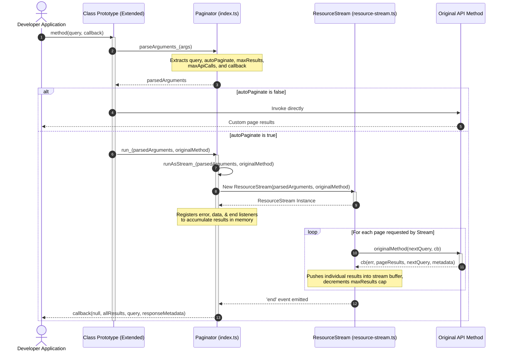

# Architectural Reference: @google-cloud/paginator
# *WARNING*: This file is AI generated and may contain inaccuracies.

This directory contains the `@google-cloud/paginator` package, a lightweight utility designed to simplify pagination across Google Cloud Node.js client libraries (such as `@google-cloud/storage`, `@google-cloud/pubsub`, `@google-cloud/bigquery`, etc.).

It wraps standard cursor-based/paginated API calls to provide:
1. **Auto-Pagination**: Transparently fetches all pages of results and yields them via a single Callback or Promise.
2. **Streaming Pagination**: Exposes an active, readable Node.js object-mode `Transform` stream that fetches pages on-demand as the consumer reads, gracefully managing backpressure and API limits.

---

## 🏗️ Architectural Overview

The package converts page-by-page request-response operations into continuous streams or buffered collections. 

Below is a sequence diagram illustrating how `paginator` wraps a typical paginated client method to provide auto-pagination:

---

## 📁 Source Files (`src/`)

### 📄 [index.ts](src/index.ts)
The entry point that defines the main `Paginator` orchestration class.

* **Role**: Monkey-patches client class prototypes, parses method arguments, and switches between buffered auto-pagination and raw manual pagination.
* **Key Mechanisms**:
  * **`extend(Class, methodNames)`**: Intercepts prototype methods. It caches the original method under `methodName_` and overrides the original method with a wrapper that parses arguments and calls `run_`.
  * **`streamify(methodName)`**: Creates a stream factory method on a class prototype, wrapping calls to return a `ResourceStream` directly.
  * **`parseArguments_(args)`**: Parses arguments passed to API calls to handle multiple signatures (e.g. optional queries or callback functions). It handles the following pagination caps and conventions:
    * **`maxResults` / `pageSize`**: Detects custom result limits. If a limit is detected or if `autoPaginate` is explicitly set to `false`, `autoPaginate` defaults to `false` so pages are not auto-fetched in the background.
    * **`maxApiCalls`**: Detects the maximum number of API calls (pages) to request.
    * **`streamOptions`**: Sanitizes user query options by stripping paginator-specific flags (`autoPaginate`, `maxResults`, `pageSize`) and passing the remaining options to the stream constructor.
  * **`run_(parsedArguments, originalMethod)`**: If `autoPaginate` is false, it bypasses the wrapper and executes the original method. If `autoPaginate` is true, it runs the paginator as a stream using `runAsStream_`, captures all data in memory, and:
    * If a **Callback** was provided: Invokes the callback with compiled results, query parameters, and raw response metadata.
    * If **no Callback** was provided: Returns a Promise that resolves with `[allResults, query, ...rawResponseMetadata]`.

---

### 📄 [resource-stream.ts](src/resource-stream.ts)
An object-mode Node.js `Transform` stream wrapper for cursored API methods.

* **Role**: Manages on-demand asynchronous fetching of paginated resources, enforcing backpressure and limit caps.
* **Key Mechanisms**:
  * **Constructor**: Initialized in `objectMode: true`. Stores the query state, caps (`maxApiCalls`, `resultsToSend` derived from `maxResults`), and original request function.
  * **`_read()`**:
    * Safe-guards against re-entrant calling by tracking `_reading` state.
    * Wraps the API function invocation in a `try-catch` block so that synchronous validation or payload preparation errors (common in services like BigQuery) are caught and emitted as stream errors (`this.destroy(err)`).
    * Executes the API call. In the callback, it:
      * Decrements `_resultsToSend` and splices the fetched array to match user-requested limits.
      * Iterates through the page results, pushing items using `this.push()`. If `push()` returns `false` (signaling downstream backpressure), iteration pauses.
      * Verifies if pagination is complete (no `_nextQuery` cursor exists, or `_resultsToSend <= 0`, or the max API call count `_maxApiCalls` has been exceeded). If so, calls `this.end()`.
      * If more results are available and the stream buffer is not full, schedules another page fetch using `setImmediate(() => this._read())`.

---

## 🧪 Test Suites (`test/`)

The testing suites reside in `test/` and fully cover the paginator and resource stream mechanics under Mocha.

### 📄 [test/index.ts](src/test/index.ts)
Unit tests focusing on prototype monkey-patching (`extend`), stream factory generation (`streamify`), argument parsing (`parseArguments_`), and callback/promise resolution buffering (`run_`).

* **Testing Strategy**: Mocks `ResourceStream` with a `FakeResourceStream` via `proxyquire` to isolate prototype and array-buffering mechanics.
* **Key Test Coverage**:
  * **`extend`**:
    * Overwriting prototype methods and caching them as `method_`.
    * Accepting both arrays of strings and single strings for method names.
    * Maintaining correct execution context (`this`) when invoking original methods.
  * **`streamify`**:
    * Instantiating and returning readable streams.
    * Sourcing the correct underlying method (specifically trying the cached private `method_` first).
  * **`parseArguments_`**:
    * Setting query defaults, detecting callback functions regardless of placement (first or last argument).
    * Mapping Pub/Sub `pageSize` convention and standard `maxResults`/`maxApiCalls`.
    * Ensuring `autoPaginate` falls back to `false` if max limits or explicit disables are supplied.
    * Stripping paginator configuration details from raw `streamOptions` passed to the stream constructor.
  * **`run_`**:
    * Buffer-on-end logic when `autoPaginate` is true (for both callback and promise execution paths).
    * Propagating error events to rejection handlers or callback errors.
    * Returning additional page-response metadata (captured in `_otherArgs`) back to caller callbacks/promise resolutes.
    * Directly calling underlying methods without buffering when `autoPaginate` is false.

---

### 📄 [test/resource-stream.ts](src/test/resource-stream.ts)
Unit tests verifying the core pagination stream lifecycle, limits, and backpressure.

* **Testing Strategy**: Employs Sinon sandboxing, spies, and fake timers to mock async paging intervals and watch stream execution.
* **Key Test Coverage**:
  * **`instantiation`**: Passing configuration options (e.g., `highWaterMark`) to the Node.js stream constructor, verifying initialization states (`_reading = false`, `_ended = false`).
  * **`end`**: Setting correct state flags and verifying proper subclass delegation to `Transform.prototype.end`.
  * **`_read`**:
    * Ensuring concurrent reads are blocked (`_reading` lock-out).
    * Handling async request callback arguments (extracting cursors, error propagation, and logging response metadata to `_otherArgs`).
    * Adjusting `_resultsToSend` counter and splicing result arrays to match limits.
    * Confirming that stream stops pushing if `end()` is called mid-push.
    * Stopping pagination when cursors run dry, or when hitting `maxResults`/`maxApiCalls` caps.
    * Verifying backpressure: when downstream buffer is full (e.g. high water mark reached), pagination halts until consumed.
    * Rescheduling next reads using `setImmediate()` only when stream is active and has buffer space.
    * Catching synchronous exceptions thrown from user request functions and safely routing them to the `'error'` stream event.

---

## 🌐 Integration & System Tests (`system-test/`)

> [!NOTE]
> This sub-package does **not** maintain a dedicated `system-test` directory.
>
> As configured in [package.json](package.json#L21), the `system-test` script simply outputs `no system test`.
> Because `@google-cloud/paginator` is a pure in-memory logical utility and stream orchestration wrapper (having no direct dependencies on external Google Cloud APIs or network environments), integration validation is handled directly inside the system tests of downstream libraries that consume it (e.g. `@google-cloud/storage`).
