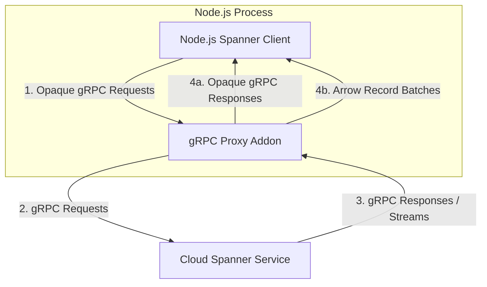

# gRPC Proxy & Apache Arrow Integration Proposal

This document describes a proposal and a prototype for separating the transport layer of the Google Cloud Spanner Node.js client library by introducing a native gRPC proxy addon compiled from Rust (using `napi-rs`) or Go (using `c-shared`).

---

## 1. Architecture

The proposal uses the existing Spanner client library in Rust or Go as a gRPC proxy. The proxy architecture shifts the gRPC request and response transport logic out of JavaScript and into a compiled native library. 



### Core Components

1. **Opaque gRPC Pass-Through:**
   gRPC request protobuf messages are encoded on the Node.js side using `protobufjs` and passed to the native proxy as opaque byte arrays. The proxy transmits these bytes over HTTP/2 connections without parsing them. 
   Similarly, gRPC response messages are returned from the proxy to Node.js as opaque byte arrays and decoded on the Node.js side. In this setup, protobuf request and response objects are only encoded and decoded once (in Node.js).
2. **Reuse of Client Libraries:**
   This allows the proxy to reuse logic that is already present in the Spanner client, such as channel pooling, merging PartialResultSets, and streaming retries/resumption.
3. **Apache Arrow Data Path:**
   For high-throughput queries (`ExecuteStreamingSql`), the native proxy decodes the `PartialResultSet` protobuf streams, processes cell values, and formats them into Arrow record batches.

---

## 2. API Design

The N-API surface area of the native proxy is restricted to two main methods:

* **`makeUnaryCall`:**
  ```typescript
  makeUnaryCall(
    methodPath: string, 
    requestBytes: ArrayBuffer, 
    headers: string[], 
    channelHint: number
  ): Promise<ArrayBuffer>
  ```
  Passes request bytes and metadata headers. It returns a promise that resolves with the single response protobuf byte array.
* **`makeStreamingCall`:**
  ```typescript
  makeStreamingCall(
    methodPath: string, 
    requestBytes: ArrayBuffer, 
    headers: string[], 
    channelHint: number,
    streamId: number
  ): void
  ```
  Initiates a streaming RPC. Response chunks (either raw protobuf bytes or serialized Arrow record batches) are sent back asynchronously via a registered JavaScript stream dispatcher callback.

---

## 3. Key Design Properties

### A. Fallback Transport Capability
Because the proxy consumes and produces opaque protobuf bytes, the Node.js client can switch dynamically between the native proxy transport and the pure JavaScript `@grpc/grpc-js` library. The higher-level Node.js client logic remains unchanged.

### B. Arrow Data Access
For high-volume read queries, the proxy can write records directly into Arrow column buffers. Users of the Node.js library can retrieve these buffers directly, bypassing the overhead of reconstructing JavaScript objects (JSON rows) in the V8 heap.

### C. Memory Management and Safety
* **Heap Boundaries:** Standard gRPC request and response byte buffers are copied across the N-API boundary to separate the Go/Rust heap memory from the V8 heap.
* **Zero-Copy Arrow Transference (Rust):** The Rust native proxy can transfer Arrow record batches zero-copy using `create_buffer_with_data` (wrapping the Rust `Vec<u8>` heap memory directly into a V8 `ArrayBuffer`).
* **Lifetime Management:** The V8 Garbage Collector manages the lifecycle of these shared buffers. When the JavaScript representation of a buffer is garbage collected, V8 calls the native finalizer function to release the underlying native memory allocation.

---

## 4. Response Flows

Depending on the RPC type and options, the native proxy handles response payloads differently:

1. **Unary Call Responses:** 
   The proxy receives the single gRPC response message, allocates a V8 `ArrayBuffer`, copies the bytes, and returns it to JavaScript to be decoded.
2. **Generic Stream Responses:** 
   The proxy receives response chunks, copies the raw bytes of each chunk, and calls the JavaScript stream dispatcher callback.
3. **ExecuteStreamingSql Responses:**
   * **Metadata and Statistics:** The native proxy encodes metadata or stats fields into a `PartialResultSet` protobuf wrapper and delivers it as an opaque byte array.
   * **Data Chunks:** The native proxy decodes the protobuf data, appends it to Arrow builders, serializes them to an Arrow IPC record batch, and transfers it to the JavaScript stream dispatcher.

---

## 5. Key Advantages

1. **Simple Fallback to `grpc-js`:** Since the boundary uses raw gRPC protobuf bytes, falling back to pure JavaScript gRPC is straightforward.
2. **Multi-Language Implementation & Logic Reuse:** The proxy interface can be implemented in multiple languages (currently prototyped in Rust and Go). Reusing an existing client library makes it easier to reuse existing (and future) logic.
3. **Minimized Protobuf Encoding/Decoding Overhead:** Protobuf requests and responses are encoded and decoded only once.
4. **Standardized Zero-Copy Data Passing:** Apache Arrow standardizes the tabular memory format. In Rust, this permits sharing the underlying native buffers with Node.js zero-copy, eliminating V8 allocation and garbage collection overhead for query results.

---

## 6. Source Code Repositories

The prototype implementations are available in the following repository branches:

- **Node.js Proxy Client & N-API Wrapper:** [google-cloud-node (branch diff: `spanner-native-proxy-prototype`)](https://github.com/googleapis/google-cloud-node/compare/main...spanner-native-proxy-prototype)
- **Go gRPC Proxy Addon:** [google-cloud-go (branch diff: `spanner-pass-through-grpc-proxy`)](https://github.com/googleapis/google-cloud-go/compare/main...spanner-pass-through-grpc-proxy)
- **Rust gRPC Proxy Addon:** [google-cloud-rust (branch diff: `spanner-pass-through-grpc-proxy`)](https://github.com/olavloite/google-cloud-rust/compare/main...spanner-pass-through-grpc-proxy)
