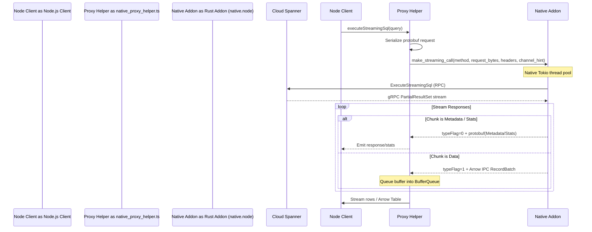

# Cloud Spanner Node.js Client Native Addon

This directory contains a Rust-based native addon powered by [napi-rs](https://napi.rs/) that offloads gRPC serialization, connection pooling, streaming, and data decoding from Node.js to a native Rust client.

---

## 1. Overview & Objective

When Node.js handles large query result sets, it faces significant performance bottlenecks due to:
* **V8/JS single-threaded event loop execution**: Parsing large amounts of incoming gRPC protobuf bytes blocks the main thread.
* **JS Protobuf decoding overhead**: Instantiating thousands of small JavaScript objects (rows, columns) causes high CPU usage and garbage collection pressure.

This native addon solves these limitations by:
1. **Delegating all data-plane gRPC RPCs** directly to a multi-threaded Rust client ([google-cloud-rust](https://github.com/olavloite/google-cloud-rust)).
2. **Returning query results via Apache Arrow IPC record batches** to Node.js.
3. **Parsing the Arrow buffers** in Node.js using `apache-arrow`, bypassing standard gRPC stream parsing.

By default, the library acts as a simple pass-through gRPC proxy for all RPCs, except for specific RPCs that are handled differently. Currently, only `ExecuteStreamingSql` is handled differently (by routing the results through Apache Arrow streams).

---

## 2. Architecture & Data Flow



### Unary Calls
For unary calls (e.g., `beginTransaction`, `commit`, `rollback`, `createSession`), the Node.js client serializes the JavaScript request object into protobuf bytes, delegates to `make_unary_call` synchronously, and deserializes the returned response bytes back into JavaScript.

### Streaming Queries (`ExecuteStreamingSql`)
For streaming SQL queries, the Rust addon uses a custom `into_arrow_stream()` implementation in the native Rust client:
* Rather than sending individual protobuf `PartialResultSet` objects, the Rust client groups query rows into **Arrow Record Batches**.
* The record batches are streamed to Node.js as raw binary IPC buffers, which are reconstructed using the fast `RecordBatchReader` from `apache-arrow`.

---

## 3. Wire Protocol & Stream Flags

When streaming data back from Rust to Node.js via `make_streaming_call`, each buffer payload is prefixed with a **1-byte type flag** at index `0`:

* **Flag `0` (Protobuf Metadata/Stats)**:
  * The payload following the flag is a protobuf-serialized `google.spanner.v1.PartialResultSet`.
  * Node.js decodes this payload to extract schema metadata (column names and types) or transaction stats (e.g., DML affected rows).
* **Flag `1` (Arrow IPC Batch)**:
  * The payload following the flag is a chunk of raw Arrow IPC record batch bytes.
  * Node.js queues these buffers into a `BufferQueue` and reads them using the `apache-arrow` `RecordBatchReader`.
  * If the user client requests standard JavaScript rows, the reader decodes individual columns vector-by-vector, which is significantly faster than standard row-by-row protobuf decoding.

---

## 4. Channel Hint Routing

Transaction workloads in Cloud Spanner require that all operations within a read/write or read-only transaction be routed over the **same physical gRPC channel** (connection pinning). 

The native proxy implements this using a `channelHint`:
1. **First operation**: Node.js calculates a round-robin index or lets the connection pool assign one. This value is saved as the transaction's `channelHint`.
2. **Subsequent operations**: All subsequent requests within that transaction reuse the same `channelHint`.
3. **Rust client**: Receives `channel_hint` inside the call parameters and routes the request to `channel_hint % NumChannelsInPool` inside the Rust client's connection pool.

---

## 5. Authentication

Authentication is handled entirely on the Rust side via **Application Default Credentials (ADC)**.
* Because the Rust client natively manages connection authentication, the Node.js client bypasses its own token generation/validation step (e.g. `auth.getAccessToken()`) whenever `USE_NATIVE_PROXY` is enabled.

---

## 6. Build & Setup

### Prerequisites
* Rust toolchain (`cargo`, `rustc`) must be installed on the machine/container building the project.

### Local Build Command
To compile the native library locally:
```bash
# Navigate to the native directory
cd handwritten/spanner/native

# Compile in release mode
cargo build --release
```
This produces `libnative.dylib` (macOS), `libnative.so` (Linux), or `native.dll` (Windows). The project's build scripts automatically copy the compiled binary to `handwritten/spanner/native/native.node` so it can be required by Node.js.

### NPM Integration
The native build is wired into `npm run compile` automatically via `scripts/build-native.js`:
```json
"scripts": {
  "build-native": "node scripts/build-native.js",
  "compile": "tsc -p . && cp -r protos build && cp -r test/data build/test && npm run build-native"
}
```
