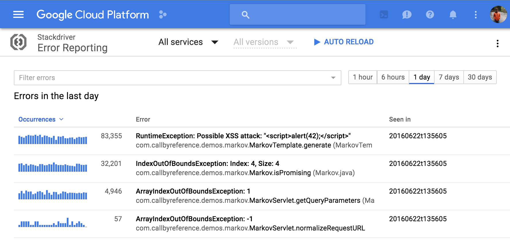

# Stackdriver Error Reporting for Node.js

[![NPM Version][npm-image]][npm-url]
[![Known Vulnerabilities][snyk-image]][snyk-url]

> This module is experimental, and should be used by early adopters.
> This module uses APIs that may be undocumented and are subject to change without notice.

This module provides Stackdriver Error Reporting support for Node.js applications.
[Stackdriver Error Reporting](https://cloud.google.com/error-reporting/) is a feature of
Google Cloud Platform that allows in-depth monitoring and viewing of errors reported by
applications running in almost any environment.



Here's an introductory video that provides some more details:

[](https://www.youtube.com/watch?v=cVpWVD75Hs8)

Note that [@google-cloud/logging-winston][logging-winston] and
[@google-cloud/logging-bunyan][logging-bunyan] automatically integrate with the
Error Reporting service for Error objects logged at severity `error` or higher,
for applications running on Google Cloud Platform. If you are already using
Winston or Bunyan in your application, and don't need direct access/control of
error reporting, you may want to check those modules as well.

## Prerequisites

1. Your application needs to use Node.js version 4.x or greater.
1. You need a [Google Cloud project](https://console.cloud.google.com). Your application can run anywhere, but errors are reported to a particular project.
1. [Enable the Stackdriver Error Reporting API](https://console.cloud.google.com/apis/api/clouderrorreporting.googleapis.com/overview) for your project.

**Note:** The module will only send errors when the `NODE_ENV` environment variable is
set to `production` or the `ignoreEnvironmentCheck` property given in the
runtime configuration object is set to `true`.  See the [Configuration](#configuration) section for more details.

## Quick Start

1. **Install the module:**

  In your project, on the command line:

```sh
  # Install through npm while saving to the local 'package.json'
  npm install --save @google-cloud/error-reporting
```

2. **Require the module:**

```js
// Require the library and initialize the error handler
var errors = require('@google-cloud/error-reporting')({
  serviceContext: {service: 'my-service'} // not needed on Google Cloud
});

// Report an error to the Stackdriver Error Reporting API
errors.report(new Error('Something broke!'));

// We also provide error handling middleware for express, hapi, restify & koa.
// See sections below.
```

3. **View reported errors:**

  Open Stackdriver Error Reporting at https://console.cloud.google.com/errors to view the reported errors.

## Unhandled Rejections

Unhandled Rejections are not reported by default.  The reporting of unhandled rejections can be enabled using the `reportUnhandledRejections` configuration option.  See the [Configuration](#configuration) section for more details.

If unhandled rejections are set to be reported, then, when an unhandled rejection occurs, a message is printed to standard out indicated that an unhandled rejection had occurred and is being reported, and the value causing the rejection is reported to the error-reporting console.

## Catching and Reporting Application-wide Uncaught Errors

Uncaught exceptions are not reported by default.  *It is recommended to process `uncaughtException`s for production-deployed applications.*

Note that uncaught exceptions are not reported by default because to do so would require adding a listener to the `uncaughtException` event.  Adding such a listener without knowledge of other `uncaughtException` listeners can cause interference between the event handlers or prevent the process from terminating cleanly.  As such, it is necessary for `uncaughtException`s to be reported manually.

```js
var errors = require('@google-cloud/error-reporting')();
process.on('uncaughtException', (e) => {
  // Write the error to stderr.
  console.error(e);
  // Report that same error the Stackdriver Error Service
  errors.report(e);
});
```

More information about uncaught exception handling in Node.js and what it means for your application can be found [here](https://nodejs.org/api/process.html#process_event_uncaughtexception).

## Running on Google Cloud Platform

All information in this section assumes that the items in the [Prerequisites](#prerequisites) section above have been completed.

### Google App Engine Flexible environment

If you are using [Google App Engine flexible environment](https://cloud.google.com/appengine/docs/flexible/), you do not have to do any additional configuration.

### Google Compute Engine

Your VM instances need to be created with the `https://www.googleapis.com/auth/cloud-platform` scope if created via the [gcloud](https://cloud.google.com/sdk) CLI or the Google Cloud Platform API, or by enabling at least one of the Stackdriver APIs if created through the browser-based console.

If you already have VMs that were created without API access and do not wish to recreate it, you can follow the instructions for using a service account under [running elsewhere](#running-elsewhere).

### Google Container Engine

As with Compute Engine, Container Engine nodes need to be created with the `https://www.googleapis.com/auth/cloud-platform` scope, which is configurable during cluster creation:
* If the cluster is being created with the `gcloud` CLI, pass the scope to the command with the `--scopes` command (multiple scopes can be [delimited with a comma](https://cloud.google.com/sdk/gcloud/reference/container/clusters/create)):

  ```sh
  gcloud container clusters create example-cluster-name --scopes https://www.googleapis.com/auth/cloud-platform
  ```

* If the cluster is being created through the Cloud Console UI, ensure that the "Cloud Platform" project access is set to "Enabled" (it's disabled by default).

Alternatively, you can also follow the instructions for using a service account under [running elsewhere](#running-elsewhere). It's recommended that you store the service account credentials as [Kubernetes Secret](http://kubernetes.io/v1.1/docs/user-guide/secrets.html).

## Running Elsewhere

If your application is running outside of Google Cloud Platform, such as locally, on-premise, or on another cloud provider, you can still use Stackdriver Errors.

1. You will need to specify your project ID when starting the errors agent.

    ```sh
    GCLOUD_PROJECT=particular-future-12345 node myapp.js
    ```

1. You need to provide service account credentials to your application by using one of the three options below:
  * The recommended way is via [Application Default Credentials][app-default-credentials].
    1. [Create a new JSON service account key][service-account].
    1. Copy the key somewhere your application can access it. Be sure not to expose the key publicly.
    1. Set the environment variable `GOOGLE_APPLICATION_CREDENTIALS` to the full path to the key. The Error Reporting library will automatically look for this environment variable.
  * If you are running your application on a development machine or test environment where you are using the [`gcloud` command line tools][gcloud-sdk], and are logged using `gcloud beta auth application-default login`, you already have sufficient credentials, and a service account key is not required.
  * Alternatively, you may set the `keyFilename` or `credentials` configuration field to the full path or contents to the key file, respectively. Setting either of these fields will override either setting `GOOGLE_APPLICATION_CREDENTIALS` or logging in using `gcloud`. For example:

    ```js
    // Require and start the agent with configuration options
    var errors = require('@google-cloud/error-reporting')({
      // The path to your key file:
      keyFilename: '/path/to/keyfile.json',

      // Or the contents of the key file:
      credentials: require('./path/to/keyfile.json')
    });
    ```

When running on Google Cloud Platform, we handle these for you automatically.

## Configuration

The following code snippet lists all available configuration options.  All configuration options are optional.

```js
var errors = require('@google-cloud/error-reporting')({
  projectId: 'my-project-id',
  keyFilename: '/path/to/keyfile.json',
  credentials: require('./path/to/keyfile.json'),
  // if true library will attempt to report errors to the service regardless
  // of the value of NODE_ENV
  // defaults to false
  ignoreEnvironmentCheck: false,
  // determines the logging level internal to the library; levels range 0-5
  // where 0 indicates no logs should be reported and 5 indicates all logs
  // should be reported
  // defaults to 2 (warnings)
  logLevel: 2,
  // determines whether or not unhandled rejections are reported to the
  // error-reporting console.  The default value of this property is true.
  reportUnhandledRejections: false,
  serviceContext: {
      service: 'my-service',
      version: 'my-service-version'
  }
});
```

## Examples

### Reporting Manually

```js
var errors = require('@google-cloud/error-reporting')();

// Use the error message builder to customize all fields ...
var errorEvt = errors.event()
                     .setMessage('My error message')
                     .setUser('root@nexus');
errors.report(errorEvt, () => console.log('done!'));

// or just use a regular error ...
errors.report(new Error('My error message'), () => console.log('done!'));

// or one can even just use a string.
errors.report('My error message');
```

The stack trace associated with an error can be viewed in the error reporting console.
* If the `errors.report` method is given an `ErrorMessage` object built using the `errors.event` method, the stack trace at the point where the error event was constructed will be used.
* If the `errors.report` method is given an `Error` object, the stack trace where the error was instantiated will be used.
* If the `errors.report` method is given a string, the stack trace at the point where `errors.report` is invoked will be used.

### Using Express

```js
var express = require('express');
var errors = require('@google-cloud/error-reporting')();

var app = express();

app.get('/error', (req, res, next) => {
  res.send('Something broke!');
  next(new Error('Custom error message'));
});

app.get('/exception', () => {
  JSON.parse('{\"malformedJson\": true');
});

// Note that express error handling middleware should be attached after all
// the other routes and use() calls. See [express docs][express-error-docs].
app.use(errors.express);

app.listen(3000);
```

### Using Hapi

```js
var hapi = require('hapi');
var errors = require('@google-cloud/error-reporting')();

var server = new hapi.Server();
server.connection({ port: 3000 });
server.start();

server.route({
  method: 'GET',
  path: '/error',
  handler: (request, reply) => {
    reply('Something broke!');
    throw new Error('Custom error message');
  }
});

server.register(errors.hapi);
```

### Using Koa

```js
var Koa = require('koa');
var errors = require('@google-cloud/error-reporting')();

var app = new Koa();

app.use(errors.koa);

app.use(function *(next) {
  //This will set status and message
  this.throw('Error Message', 500);
});

// response
app.use(function *(){
  this.body = 'Hello World';
});

app.listen(3000);
```

### Using Restify

```js
var restify = require('restify');
var errors = require('@google-cloud/error-reporting')();

function respond(req, res, next) {
  next(new Error('this is a restify error'));
}

var server = restify.createServer();

server.use(errors.restify(server));
server.get('/hello/:name', respond);
server.head('/hello/:name', respond);

server.listen(3000);
```

[app-default-credentials]: https://developers.google.com/identity/protocols/application-default-credentials
[express-error-docs]: https://expressjs.com/en/guide/error-handling.html
[gcloud-sdk]: https://cloud.google.com/sdk/gcloud/
[logging-bunyan]: https://www.npmjs.com/package/@google-cloud/logging-bunyan
[logging-winston]: https://www.npmjs.com/package/@google-cloud/logging-winston
[npm-image]: https://badge.fury.io/js/%40google-cloud%2Ferror-reporting.svg
[npm-url]: https://npmjs.org/package/@google-cloud/error-reporting
[service-account]: https://console.developers.google.com/apis/credentials/serviceaccountkey
[snyk-image]: https://snyk.io/test/npm/@google-cloud/error-reporting/badge.svg
[snyk-url]: https://snyk.io/test/npm/@google-cloud/error-reporting
